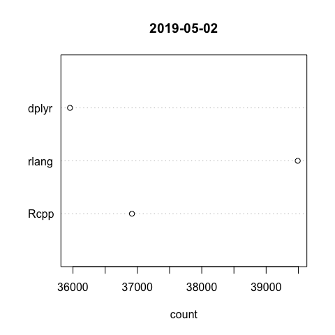
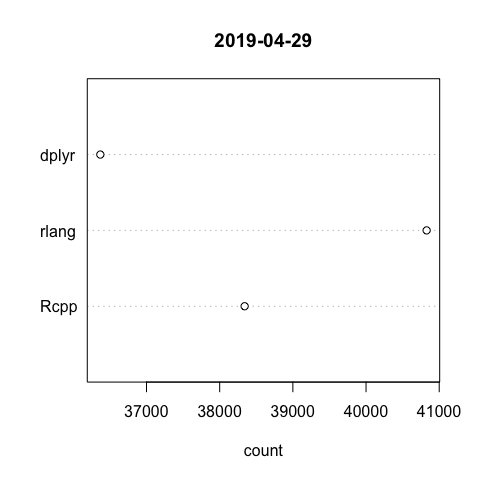

<!-- README.md is generated from README.Rmd. Please edit that file -->

[](https://github.com/lindbrook/packageRank/blob/master/NEWS)

## ‘packageRank’

The ‘[cranlogs](https://cran.r-project.org/package=cranlogs)’ package
computes the number of downloads logged on RStudio’s [CRAN
mirror](http://cran-logs.rstudio.com). For example, we can see that the
‘[HistData](https://cran.r-project.org/package=HistData)’ pacakge was
downloaded 51 times on the first day of 2019 and 787 times in the first
week:

``` r
cranlogs::cran_downloads(packages = "HistData", from = "2019-01-01", to = "2019-01-01")
>         date count  package
> 1 2019-01-01    51 HistData
```

``` r
cranlogs::cran_downloads(packages = "HistData", from = "2019-01-01", to = "2019-01-07")
>         date count  package
> 1 2019-01-01    51 HistData
> 2 2019-01-02   100 HistData
> 3 2019-01-03   137 HistData
> 4 2019-01-04   113 HistData
> 5 2019-01-05    85 HistData
> 6 2019-01-06    96 HistData
> 7 2019-01-07   205 HistData
```

In both instances, the familiar “compared to what?” question lurks in
the background. Is the 51 downloads large or small? Is the pattern in
the first week of January typical or unusual? The aim of ‘packageRank’
is to help answer these questions by providing some numerical and visual
perspective.

### computation

‘packageRank’ computes a package’s rank percentile (“percentile”) and
nominal rank (“rank”):

``` r
packageRank(package = "HistData", date = "2019-01-01")
>         date  package downloads percentile          rank
> 1 2019-01-01 HistData        51       93.4 920 of 14,020
```

In this case, those 51 downloads put ‘HistData’ in the 93rd percentile
(93% of packages had fewer downloads) and in 920th place of the 14,020
packages downloaded.\[1\]

However, the 920th place ranking is only “nominal”. This is because it’s
possible, especially when the number of downloads is small, that
mulitiple packages will have the same number of downloads. As a result,
a package’s rank will sometimes be determined by the fact that packages
with the same number of downloads are sorted alphabetically:
‘HistData’’s nominal rank benefits from the fact that it appears
second in the vector of packages with 51 downloads:

``` r
pkg.rank <- packageRank(package = "HistData", date = "2019-01-01")
downloads <- pkg.rank$crosstab

downloads[downloads == 51]
> 
>  dynamicTreeCut        HistData          kimisc  NeuralNetTools 
>              51              51              51              51 
>   OpenStreetMap       pkgKitten plotlyGeoAssets            spls 
>              51              51              51              51 
>        webutils            zoom 
>              51              51
```

### visualization (cross-sectional)

‘packageRank’ visualizes a package’s position in the distribution of a
given day’s
downloads.

``` r
plot(packageRank(package = "HistData", date = "2019-05-01"), graphics_pkg = "base")
```


The cross-sectional view above plots a package’s rank (x-axis) against
the logarithm of its downloads (y-axis). The plot highlights the
selected package’s relative position in the distribution along with its
percentile and its number of downloads (in red). The plot also shows the
location of the 75th, 50th and 25th percentiles (dotted gray vertical
lines) as well as the package with the most downloads (‘devtools’) and
the total number of downloads (2,982,767) from the CRAN mirror (both in
blue).

Just like cranlogs::cran\_downloads(), you can also pass a vector of
packages:

``` r
plot(packageRank(package = c("cholera", "HistData", "regtools"), date = "2019-05-01"),
  graphics_pkg = "ggplot2")
```


### visualization (longitudinal)

In more limited fashion, ‘packageRank’ visualizes a package’s position
in the distribution of downloads over time (currently only “last-week”
and
“last-month”).

``` r
plot(packageRankTime(package = "HistData", when = "last-month"), graphics_pkg = "base")
```


The longitudinal view above plots the date (x-axis) against the
logarithm of a package’s downloads (y-axis) (in red). In the background,
the function plots the same data (in gray) using a cohort defined by a
stratified random sample of packages.\[2\] This cohort is used to
estimate of the overall temporal pattern of package downloads.

As above, you can pass a vector of
packages:

``` r
plot(packageRankTime(package = c("Rcpp", "HistData", "rlang"), when = "last-month"))
```


### memoization

To reduce the need to re-download logs for each function call,
packageRank() and packageRankTime() use the ‘memoise’ package:

``` r
fetchLog <- function(x) data.table::fread(x)

mfetchLog <- memoise::memoise(fetchLog)

if (RCurl::url.exists(url)) {
  cran_log <- mfetchLog(url)
}
```

### plot.cranlogs()

The cran\_downloads2() function essentially duplicates
cranlogs::cran\_downloads() but adds a class to allow for the use of S3
generic plot
methods.

``` r
plot(cran_downloads2(package = c("Rcpp", "rlang", "dplyr")), graphics_pkg = "base")
```



``` r
plot(cran_downloads2(package = c("Rcpp", "rlang", "dplyr"), from = "2019-01-01", to = "2019-01-31"))
```



### base R graphics and ‘ggplot2’

All plot functions are available in both base R graphics and ‘ggplot2’
flavors via the graphics\_pkg argument (“base” or “ggplot2”).

### Installation

To install the development version of ‘packageRank’ from GitHub:

``` r
devtools::install_github("lindbrook/packageRank")
```

‘packageRank’ relies on an active internet connection.

### Notes

1.  Note that because packages with zero downloads are not recorded in
    the log, there is a censoring problem.

2.  Within each 5% rank percentile bin (e.g., 0 to 5, 5 to 10, etc.), a
    random sample of 5% of packages is selected and then tracked over
    time as a cohort.
