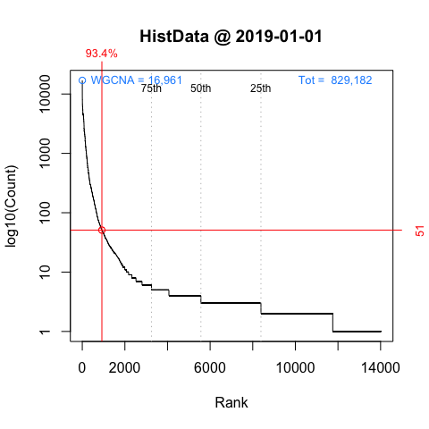
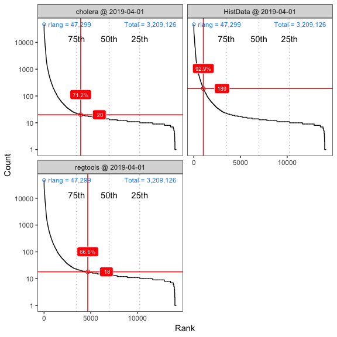
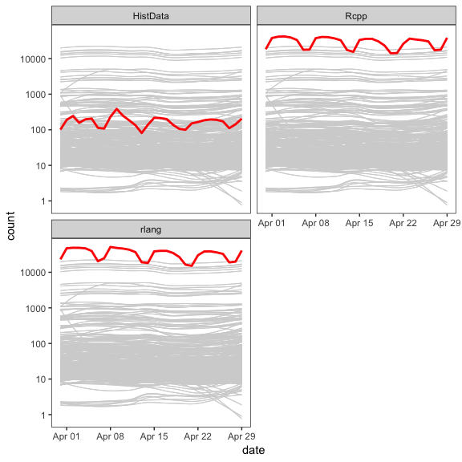
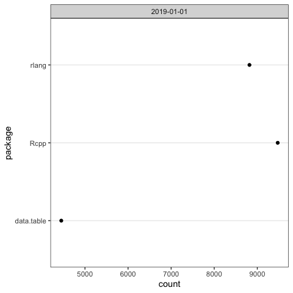
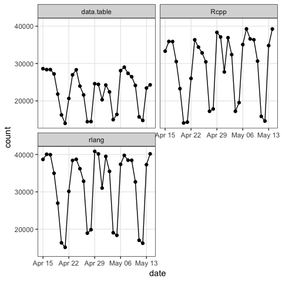
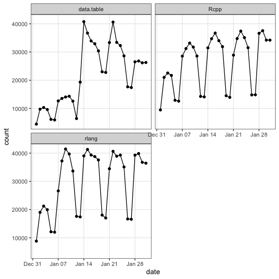

<!-- README.md is generated from README.Rmd. Please edit that file -->
[](https://cran.r-project.org/package=packageRank)
[](https://github.com/lindbrook/packageRank/blob/master/NEWS)
## packageRank: compute and visualize package download counts and percentiles

### features

  - compute the rank percentile and nominal rank of a package’s
    downloads from RStudio’s [CRAN
    mirror](http://cran-logs.rstudio.com).
  - visualize a package’s position in the distribution of package
    download counts for a given day (cross-sectionally) or over time
    (longitudinally).
  - provide S3 plot methods for ‘cranlogs’ output.

NOTE: ‘packageRank’ relies on an active internet connection.

### background

The ‘[cranlogs](https://cran.r-project.org/package=cranlogs)’ package
computes the number of downloads using RStudio’s [CRAN
mirror](http://cran-logs.rstudio.com). For example, we can see that the
‘[HistData](https://cran.r-project.org/package=HistData)’ package was
downloaded 51 times on the first day of 2019:

``` r
cranlogs::cran_downloads(packages = "HistData", from = "2019-01-01",
  to = "2019-01-01")
>         date count  package
> 1 2019-01-01    51 HistData
```

And 787 times in the first week:

``` r
cranlogs::cran_downloads(packages = "HistData", from = "2019-01-01",
  to = "2019-01-07")
>         date count  package
> 1 2019-01-01    51 HistData
> 2 2019-01-02   100 HistData
> 3 2019-01-03   137 HistData
> 4 2019-01-04   113 HistData
> 5 2019-01-05    85 HistData
> 6 2019-01-06    96 HistData
> 7 2019-01-07   205 HistData
```

In both cases, the “compared to what?” question lurks in the background.
Is 51 downloads large or small? Is the pattern during that week typical
or unusual? To help answer these questions, ‘packageRank’ tries to
provide some perspective on package download counts.

### compute percentiles and ranks

To do so, in addition to raw download counts we can compute the rank
percentile and nominal rank of a package’s downloads. Simply use
`packageRank()`:

``` r
packageRank(packages = "HistData", date = "2019-01-01")
>         date packages downloads percentile          rank
> 1 2019-01-01 HistData        51       93.4 920 of 14,020
```

Here, we see that 51 downloads places ‘HistData’ in the 93rd percentile.
This statistic, familiar to anyone who’s taken a standardized test, tell
us that 93% of packages had fewer downloads than ‘HistData’:\[1\]

``` r
pkg.rank <- packageRank(packages = "HistData", date = "2019-01-01")
downloads <- pkg.rank$crosstab

round(100 * mean(downloads < downloads["HistData"]), 1)
> [1] 93.4

# OR

(pkgs.with.fewer.downloads <- sum(downloads < downloads["HistData"]))
> [1] 13092

(tot.pkgs <- length(downloads))
> [1] 14020

round(100 * pkgs.with.fewer.downloads / tot.pkgs , 1)
> [1] 93.4
```

We also see that 51 downloads “nominally” earns ‘HistData’ 920th place
among the 14,020 packages downloaded. Note that this rank is “nominal”
because it’s possible that multiple packages share identical download
counts. In such cases, a package’s nominal rank (but not its rank
percentile) will sometimes be determined by its name: packages with the
same number of downloads are listed in alphabetical order. For the case
at hand, ‘HistData’ benefits from the fact that it is second in the list
(vector) of packages with 51 downloads:

``` r
pkg.rank <- packageRank(packages = "HistData", date = "2019-01-01")
downloads <- pkg.rank$crosstab

downloads[downloads == 51]
> 
>  dynamicTreeCut        HistData          kimisc  NeuralNetTools 
>              51              51              51              51 
>   OpenStreetMap       pkgKitten plotlyGeoAssets            spls 
>              51              51              51              51 
>        webutils            zoom 
>              51              51
```

To avoid the bottleneck of downloading multiple log files,
`packageRank()` is currently limited to individual days. However, to
reduce the need to re-download logs for a given day, ‘packageRank’ makes
use of memoization via the ‘memoise’ package.

### memoization

Here’s relevant code:

``` r
fetchLog <- function(x) data.table::fread(x)

mfetchLog <- memoise::memoise(fetchLog)

if (RCurl::url.exists(url)) {
  cran_log <- mfetchLog(url)
}
```

If you use `fetchLog()`, the log file, which can sometimes be as large
as 50 MB, will be downloaded every time you call the function. If you
use `mfetchLog()`, logs are intelligently cached: logs that have already
been downloaded (in your current R session) will not be downloaded
again.

### visualization (cross-sectional)

To visualize a package’s position in the distribution on a given day’s
downloads, use the following:

``` r
plot(packageRank(packages = "HistData", date = "2019-05-01"),
  graphics_pkg = "base")
```



This cross-sectional view plots a package’s rank (x-axis) against the
logarithm of its downloads (y-axis) and highlights the package’s
relative position in the overall distribution. In addition, it
illustrates its percentile and its number of downloads (in red); the
location of the 75th, 50th and 25th percentiles (dotted gray vertical
lines); the package with the most downloads (in this case ‘devtools’)
and the total number of downloads (2,982,767) on that day (both in
blue).

Just like cranlogs::cran\_downloads(), you can also pass a vector of
packages:

``` r
plot(packageRank(packages = c("cholera", "HistData", "regtools"),
  date = "2019-05-01"))
```



### visualization (longitudinal)

To visualize a package’s position in the distribution on a given day’s
downloads, use `packageRankTime()`. Currently, only two time frames,
“last-week” and “last-month”, are available.

``` r
plot(packageRankTime(packages = "HistData", when = "last-month"),
  graphics_pkg = "base")
```


The longitudinal view plots the date (x-axis) against the logarithm of a
package’s downloads (y-axis). In the background, we can see the same
data, plotted in gray, for a stratified random sample of packages.\[2\]
This sample is used to approximate the temporal pattern of all package
downloads.

As above, you can pass a vector of packages:

``` r
plot(packageRankTime(packages = c("Rcpp", "HistData", "rlang"),
  when = "last-month"))
```



### visualizing ‘cranlogs’

To visualize the download counts from `cranlogs::cran_download()`,
‘packageRank’ provides easy-to-use S3 generic plot() methods. All you
need to do is to use cran\_downloads2() in place of cran\_download():

``` r
plot(cran_downloads2(packages = c("data.table", "Rcpp", "rlang"),
  from = "2019-01-01", to = "2019-01-01"), graphics_pkg = "base")
```



``` r
plot(cran_downloads2(packages = c("data.table", "Rcpp", "rlang"),
  when = "last-month"))
```



``` r
plot(cran_downloads2(packages = c("data.table", "Rcpp", "rlang"),
  from = "2019-01-01", to = "2019-01-31"))
```



### graphics: base R and ‘ggplot2’

All plot are available as both base R graphics and ‘ggplot2’ figures via
the graphics\_pkg argument (“base” or “ggplot2”) in the plot() methods.

### installation

To install ‘packageRank’ from CRAN:

``` r
install.packages("packageRank")
```

To install the development version of ‘packageRank’ from
GitHub:

``` r
devtools::install_github("lindbrook/packageRank", build_vignettes = TRUE)
```

### Notes

1.  Note that because packages with zero downloads are not recorded in
    the log, there is a censoring problem.

2.  Within each 5% interval of rank percentiles (e.g., 0 to 5, 5 to 10,
    95 to 100, etc.), a random sample of 5% of packages is selected and
    tracked over time.
