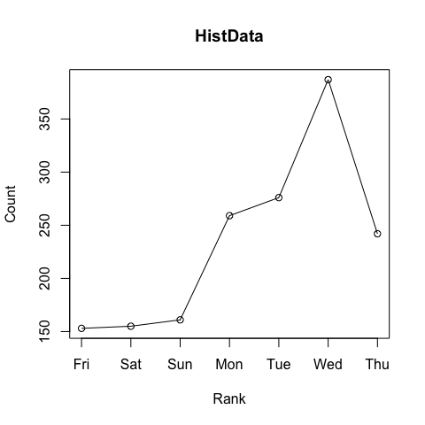
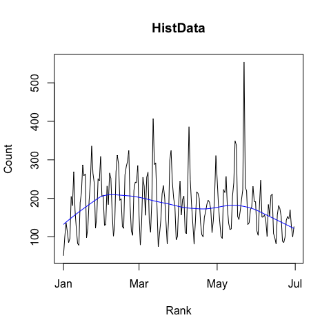

<!-- README.md is generated from README.Rmd. Please edit that file -->
[](https://cran.r-project.org/package=packageRank)
[](https://github.com/lindbrook/packageRank/blob/master/NEWS)
## packageRank: compute and visualize package download counts and percentiles

### features

  - compute and visualize the counts and ranks (nominal and percentile)
    of downloads from RStudio’s [CRAN
    mirror](http://cran-logs.rstudio.com) or from
    [Bioconductor](https://bioconductor.org/).
  - provide S3 plot methods for `cranlogs::cran_downloads()`.

NOTE: ‘packageRank’ relies on an active internet connection.

### getting started

To install ‘packageRank’ from CRAN:

``` r
install.packages("packageRank")
```

To install the latest development version from
GitHub:

``` r
# You may need to first install the 'remotes' via install.packages("remotes").

remotes::install_github("lindbrook/packageRank", build_vignettes = TRUE)
```

### background

The ‘[cranlogs](https://cran.r-project.org/package=cranlogs)’ package
computes the raw number of downloads of packages or R using RStudio’s
[CRAN mirror](http://cran-logs.rstudio.com). For example, we can see
that on the first day of 2019 the
‘[HistData](https://cran.r-project.org/package=HistData)’ package was
downloaded 51
times:

``` r
cranlogs::cran_downloads(packages = "HistData", from = "2019-01-01", to = "2019-01-01")
>         date count  package
> 1 2019-01-01    51 HistData
```

Lurking in the background is the “compared to what?” question. Is 51
downloads large or small? To answer these questions, ‘packageRank’ puts
package download counts into greater context.

### compute percentiles and ranks

One way to do so is to compute the rank percentile and nominal rank of a
package’s downloads (See the section “computing rank percentiles” below
for details on computation):

``` r
packageRank(packages = "HistData", date = "2019-01-01")
>         date packages downloads percentile          rank
> 1 2019-01-01 HistData        51       93.4 920 of 14,020
```

Here, we see that 51 downloads put ‘HistData’ in the 93rd percentile.
This statistic, familiar to anyone who’s taken a standardized test, tell
us that 93% of packages had fewer downloads than ‘HistData’ (Note that
because packages with zero downloads are not recorded in the log, there
is a censoring problem.).

### visualization (cross-sectional)

We can also visualize the rank percentile using packageRank()’s generic
S3 plot
method:

``` r
plot(packageRank(packages = "HistData", date = "2019-01-01"))
```


This cross-sectional view plots a package’s rank (x-axis) against the
base 10 logarithm of its downloads (y-axis) and highlights its position
in the overall distribution of downloads. In addition, the plot
illustrates 1) a package’s rank percentile and raw count of downloads
(in red); 2) the location of the 75th, 50th and 25th percentiles (dotted
gray vertical lines); 3) the package with the most downloads, in this
case ‘WGCNA’ (in blue, top left); and 4) the total number of downloads
(2,982,767 for CRAN) (in blue, top right).

You can also pass a vector of
packages:

``` r
plot(packageRank(packages = c("cholera", "HistData", "regtools"), date = "2019-01-01"))
```


You can also look up [Bioconductor](https://bioconductor.org/)
packages:

``` r
plot(bioconductorRank(packages = "cicero", date = "2019-01"))
```


### visualization (longitudinal)

To visualize a package’s relative position over time, use
`packageRankTime()`:

``` r
plot(packageRankTime(packages = "HistData", when = "last-month"), graphics_pkg = "base")
```


This longitudinal view plots the date (x-axis) against the logarithm of
a package’s downloads (y-axis).

In the background, the same variable are plotted (in gray) for a
stratified random sample of packages: within each 5% interval of rank
percentiles (e.g., 0 to 5, 5 to 10, 95 to 100, etc.), a random sample of
5% of packages is selected and tracked over time. This sample
approximates the “typical” pattern of package downloads for that time
period. Note that for this function, only two time frames are currently
available: “last-week” and “last-month”. Also, a version for
[Bioconductor](https://bioconductor.org/) packages is not currently
available.

### computing download counts

To compute or plot package download counts, ‘packageRank’ offers a
couple of choices. If you want to use ‘cranlogs’ style syntax, use
‘cran\_downloads2()’.

``` r
cranlogs::cran_downloads(packages = "HistData", when = "last-week")

cran_downloads2(packages = "HistData", when = "last-week")
```

The only difference between ‘cran\_downloads2()’ and
‘cranlogs::cran\_downloads()’ is that ‘cran\_downloads2()’ has a
generic S3 plot method.

``` r
plot(cran_downloads2(packages = "HistData", when = "last-week"))
```

<!-- -->

Otherwise, I recommend using `cranDownloads()`. Not only does it have a
plot method, but it has a more flexible interface, especially for the
‘for’ and ‘to’ arguments. With ‘cranlogs::cran\_downloads’, you have
to write out the entire 10 character date. With ‘cranDownloads()’, you
can provide dates as: yyyy-mm-dd, yyyy-mm or yyyy:

``` r
# Downloads from December 31, 2018 throught June 25, 2019
plot(cranDownloads(packages = "HistData", from = "2018-12-31", to = "2019-06-25"), points = FALSE, 
  smooth = TRUE)
```

<!-- -->

``` r

# Downloads from June 2015 through June 2019
plot(cranDownloads(packages = "HistData", from = "2015-06", to = "2019-06"), points = FALSE)
```

<!-- -->

``` r

# Year-to-date
plot(cranDownloads(packages = "HistData", from = "2019"), points = FALSE, smooth = TRUE)
```

<!-- -->

For Bioconductor packages, use ‘bioconductorDownloads()’. Note that logs
are aggreated to the month or to the calendar year; so dates must either
be yyyy-mm or yyyy.

``` r
# Downloads from June 2015 through June 2019
plot(bioconductorDownloads(packages = "monocle", from = "2015-06", to = "2019-06"), points = FALSE)
```

<!-- -->

``` r

# Year-to-date
plot(bioconductorDownloads(packages = "monocle", from = "2019"))
```

<!-- -->

Note that the red square indicates an in-progress observation.

### graphics: base R and ‘ggplot2’

All plot are available as both base R and ‘ggplot2’ graphs. By default,
plot with single frame/panels (one package or one day) use base graphics
while those with multiple frames/panels use ‘ggplot2’. You can override
these defaults by using the “graphics” argument in the plot() method.

### memoization

To avoid the bottleneck of downloading multiple log files,
`packageRank()` is limited to individual days. However, to reduce the
need to re-download logs for a given day, ‘packageRank’ makes use of
memoization via the ‘memoise’ package.

Here’s relevant code:

``` r
fetchLog <- function(x) data.table::fread(x)

mfetchLog <- memoise::memoise(fetchLog)

if (RCurl::url.exists(url)) {
  cran_log <- mfetchLog(url)
}
```

If you use `fetchLog()`, the log file, which can sometimes be as large
as 50 MB, will be downloaded every time you call the function. If you
use `mfetchLog()`, logs are intelligently cached; those that have
already been downloaded, in your current R session, will not be
downloaded again.

### computing rank percentiles

``` r
pkg.rank <- packageRank(packages = "HistData", date = "2019-01-01")
downloads <- pkg.rank$crosstab

round(100 * mean(downloads < downloads["HistData"]), 1)
> [1] 93.4

# OR

(pkgs.with.fewer.downloads <- sum(downloads < downloads["HistData"]))
> [1] 13092

(tot.pkgs <- length(downloads))
> [1] 14020

round(100 * pkgs.with.fewer.downloads / tot.pkgs , 1)
> [1] 93.4
```

We also see that 51 downloads put ‘HistData’ in 920th place among the
14,020 packages with at least one download. This rank is “nominal”
because multiple packages can have the same number of downloads. As a
result, a package’s nominal rank (but not its rank percentile) can be
affected by its names: packages with the same number of downloads are
sorted in alphabetical order. For the case at hand, ‘HistData’ benefits
from the fact that it is second in the list of packages with 51
downloads:

``` r
pkg.rank <- packageRank(packages = "HistData", date = "2019-01-01")
downloads <- pkg.rank$crosstab

downloads[downloads == 51]
> 
>  dynamicTreeCut        HistData          kimisc  NeuralNetTools 
>              51              51              51              51 
>   OpenStreetMap       pkgKitten plotlyGeoAssets            spls 
>              51              51              51              51 
>        webutils            zoom 
>              51              51
```
