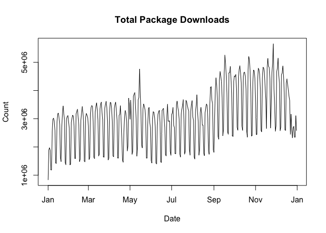
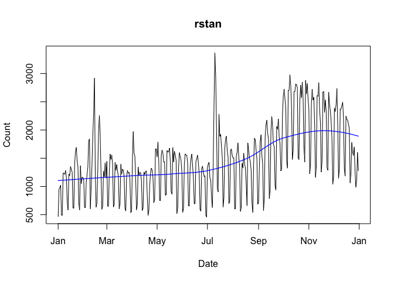

<!-- README.md is generated from README.Rmd. Please edit that file -->
[](https://cran.r-project.org/package=packageRank)
[](https://github.com/lindbrook/packageRank/blob/master/NEWS)
## packageRank: compute and visualize package download counts and rank percentiles

[‘packageRank’](https://CRAN.R-project.org/package=packageRank) is an R
package that helps put package download counts into context.

It does so via two functions, `cranDownloads()` and `packageRank()`, and
a set of filters that clean log files.

`cranDownloads()` extends the functionality of
[`cranlogs::cran_downloads()`](http://r-hub.github.io/cranlogs/) by
adding a more user-friendly interface and providing a generic R `plot()`
method to makes visualization easy.

`packageRank()` uses rank percentiles, a nonparametric statistic that
tells you the percentage of observations (i.e., packages) with fewer
counts (i.e., downloads), to help you see how your package is doing
relative to *all* other [CRAN](https://CRAN.R-project.org/) packages.

The filters try to remove software artifacts (e.g., downloads that are
too “small”) and behavioral artifacts (e.g., efforts to download all of
[CRAN](https://CRAN.R-project.org/)) that inflate the package download
count

Note that
[‘packageRank’](https://CRAN.R-project.org/package=packageRank) requires
an active internet connection, and relies on the
[‘cranlogs’](https://CRAN.R-project.org/package=cranlogs) package and
[RStudio’s download logs](http://cran-logs.rstudio.com/). The latter
record traffic to what was previously called RStudio’s [CRAN
mirror](http://cran.rstudio.com) and which is now listed as the
[“0-Cloud” mirror](http://cloud.r-project.org) “sponsored by RStudio”.
Logs for the previous day are generally posted by 17:00 UTC. Updated
results for functions that rely on ‘cranlogs’ are generally available
soon thereafter.

### I - getting started

To install ‘packageRank’ from CRAN:

``` r
install.packages("packageRank")
```

To install the development version from GitHub:

``` r
# You may need to first install 'remotes' via install.packages("remotes").
remotes::install_github("lindbrook/packageRank", build_vignettes = TRUE)
```

### II - computing package download counts

`cranDownloads()` uses all the same arguments as
`cranlogs::cran_downloads()`:

``` r
cranlogs::cran_downloads(packages = "HistData")
```

    >         date count  package
    > 1 2020-05-01   338 HistData

The only difference is that `cranDownloads()` adds four features:

#### i) “spell check” for package names

``` r
cranDownloads(packages = "GGplot2")
```

    ## Error in cranDownloads(packages = "GGplot2") :
    ##   GGplot2: misspelled or not on CRAN.

<br/>

``` r
cranDownloads(packages = "ggplot2")
```

    >         date count cumulative package
    > 1 2020-05-01 56357      56357 ggplot2

<br/> This also works for inactive or “retired” packages in the
[Archive](https://CRAN.R-project.org/src/contrib/Archive):

``` r
cranDownloads(packages = "vr")
```

    ## Error in cranDownloads(packages = "vr") :
    ##  vr: misspelled or not on CRAN/Archive.

<br/>

``` r
cranDownloads(packages = "VR")
```

    >         date count cumulative package
    > 1 2020-05-01    11         11      VR

<br/>

#### ii) two additional date formats

With `cranlogs::cran_downloads()`, you specify a time frame using the
`from` and `to` arguments. The downside of this is that you *must* use
the “yyyy-mm-dd” date format. For convenience’s sake, `cranDownloads()`
also allows you to use “yyyy-mm” or “yyyy” (yyyy also works).

##### “yyyy-mm”

Let’s say you want the download counts for
[‘HistData’](https://CRAN.R-project.org/package=HistData) for the month
of February 2020. With `cranlogs::cran_downloads()`, you’d have to type
out the whole date and remember that 2020 was a leap year:

``` r
cranlogs::cran_downloads(packages = "HistData", from = "2020-02-01",
  to = "2020-02-29")
```

<br/> With `cranDownloads()`, you can just specify the year and month:

``` r
cranDownloads(packages = "HistData", from = "2020-02", to = "2020-02")
```

##### “yyyy” or yyyy

Let’s say you want the year-to-date download counts for
[‘rstan’](https://CRAN.R-project.org/package=rstan). With
`cranlogs::cran_downloads()`, you’d type something like:

``` r
cranlogs::cran_downloads(packages = "rstan", from = "2021-01-01",
  to = Sys.Date() - 1)
```

<br/> With `cranDownloads()`, you can use:

``` r
cranDownloads(packages = "rstan", from = "2021")
```

or

``` r
cranDownloads(packages = "rstan", from = 2021)
```

<br/>

#### iii) check date validity

``` r
cranDownloads(packages = "HistData", from = "2019-01-15",
  to = "2019-01-35")
```

    ## Error in resolveDate(to, type = "to") : Not a valid date.

#### iv) cumulative count

``` r
cranDownloads(packages = "HistData", when = "last-week")
```

    >         date count cumulative  package
    > 1 2020-05-01   338        338 HistData
    > 2 2020-05-02   259        597 HistData
    > 3 2020-05-03   321        918 HistData
    > 4 2020-05-04   344       1262 HistData
    > 5 2020-05-05   324       1586 HistData
    > 6 2020-05-06   356       1942 HistData
    > 7 2020-05-07   324       2266 HistData

<br/>

### III - visualizing package downloads

`cranDownloads()` makes visualizing package downloads easy. Just use
`plot()`:

``` r
plot(cranDownloads(packages = "HistData", from = "2019", to = "2019"))
```


If you pass a vector of package names for a single day, `plot()` will
return a dotchart:

``` r
plot(cranDownloads(packages = c("ggplot2", "data.table", "Rcpp"),
  from = "2020-03-01", to = "2020-03-01"))
```


If you pass a vector of package names for multiple days, `plot()` uses
`ggplot2` facets:

``` r
plot(cranDownloads(packages = c("ggplot2", "data.table", "Rcpp"),
  from = "2020", to = "2020-03-20"))
```


<br/>

If you want to plot those data in a single frame, set
`multi.plot = TRUE`:

``` r
plot(cranDownloads(packages = c("ggplot2", "data.table", "Rcpp"),
  from = "2020", to = "2020-03-20"), multi.plot = TRUE)
```

<!-- -->

<br/> If you want plot those data in separate plots on the same scale,
use `graphics = "base"` and you’ll be prompted for each plot:

``` r
plot(cranDownloads(packages = c("ggplot2", "data.table", "Rcpp"),
  from = "2020", to = "2020-03-20"), graphics = "base")
```

If you want do the above on spearate independent scales, set
`same.xy = FALSE`:

``` r
plot(cranDownloads(packages = c("ggplot2", "data.table", "Rcpp"),
  from = "2020", to = "2020-03-20"), graphics = "base", same.xy = FALSE)
```

#### `packages = NULL`

`cranlogs::cran_download(packages = NULL)` computes the total number of
package downloads from CRAN. You can plot these data by using:

``` r
plot(cranDownloads(from = 2019, to = 2019))
```

<!-- -->

#### `packages = "R"`

`cranlogs::cran_download(packages = "R")` computes the total number of
downloads of the R application (note that you can only use “R” or a
vector of packages names, not both!). You can plot these data by using:

``` r
plot(cranDownloads(packages = "R", from = 2019, to = 2019))
```

<!-- -->

#### smoothers and confidence intervals

To add a lowess smoother to your plot, use `smooth = TRUE`:

``` r
plot(cranDownloads(packages = "rstan", from = "2019", to = "2019"),
  smooth = TRUE)
```

<!-- -->

With graphs that use ‘ggplot2’, `se = TRUE` will add confidence
intervals:

``` r
plot(cranDownloads(packages = c("HistData", "rnaturalearth", "Zelig"),
  from = "2020", to = "2020-03-20"), smooth = TRUE, se = TRUE)
```

<!-- -->

#### package and R release dates

To annotate a graph with a package’s release dates:

``` r
plot(cranDownloads(packages = "rstan", from = "2019", to = "2019"),
  package.version = TRUE)
```

<!-- -->

To annotate a graph with R release dates:

``` r
plot(cranDownloads(packages = "rstan", from = "2019", to = "2019"),
  r.version = TRUE)
```

<!-- -->

#### plot growth curves (cumulative download counts)

To plot growth curves, set `statistic = "cumulative"`:

``` r
plot(cranDownloads(packages = c("ggplot2", "data.table", "Rcpp"),
  from = "2020", to = "2020-03-20"), statistic = "cumulative",
  multi.plot = TRUE, points = FALSE)
```

<!-- -->

#### population plot

To visualize a package’s downloads relative to “all” other packages over
time:

``` r
plot(cranDownloads(packages = "HistData", from = "2020", to = "2020-03-20"),
  population.plot = TRUE)
```

<!-- -->

This longitudinal view of package downloads plots the date (x-axis)
against the logarithm of a package’s downloads (y-axis). In the
background, the same variable are plotted (in gray) using a stratified
random sample of packages: within each 5% interval of rank percentiles
(e.g., 0 to 5, 5 to 10, 95 to 100, etc.), a random sample of 5% of
packages is selected and tracked. This graphically approximates the
“typical” pattern of downloads on CRAN for the selected time period.

### IV - computing package download rank percentiles

Looking at nominal download count data leads one to the “compared to
what?” question. For instance, consider the data for the first week of
March 2020:

``` r
plot(cranDownloads(packages = "cholera", from = "2020-03-01",
  to = "2020-03-07"))
```


Do Wednesday and Saturday reflect surges of interest in the package or
surges of traffic to [CRAN](https://CRAN.R-project.org/)? To put it
differently, how can we know if a given download count is typical or
unusual? One way to answer these questions is to locate your package in
the frequency distribution of download counts.

Below are the distributions of logarithm of download counts for
Wednesday and Saturday. The location of a vertical segment along the
x-axis represents a download count and the height of a segment
represents that download count’s frequency. The location of
[‘cholera’](https://CRAN.R-project.org/package=cholera) in the
distribution is highlighted in red.

``` r
plot(packageDistribution(package = "cholera", date = "2020-03-04"))
```


``` r
plot(packageDistribution(package = "cholera", date = "2020-03-07"))
```


While these plots give us a better picture of where
[‘cholera’](https://CRAN.R-project.org/package=cholera) is located,
comparisons between Wednesday and Saturday are impressionistic at best:
all we can confidently say is that the download counts for both days
were greater than the mode.

To facilitate interpretation and comparison, I use the *rank percentile*
of a download count in place of the nominal download count. This
nonparametric statistic tells you the percentage of packages with fewer
downloads. In other words, it gives you the location of your package
relative to the locations of all other packages. More importantly, by
rescaling download counts to lie on the bounded interval between 0 and
100, rank percentiles make it easier to compare packages within and
across distributions.

For example, we can compare Wednesday (“2020-03-04”) to Saturday
(“2020-03-07”):

``` r
packageRank(package = "cholera", date = "2020-03-04", ip.filter = FALSE, small.filter = FALSE)
>         date packages downloads            rank percentile
> 1 2020-03-04  cholera        38 5,556 of 18,038       67.9
```

On Wednesday, we can see that
[‘cholera’](https://CRAN.R-project.org/package=cholera) had 38
downloads, came in 5,556th place out of 18,038 unique packages
downloaded, and earned a spot in the 68th percentile.

``` r
packageRank(package = "cholera", date = "2020-03-07", ip.filter = FALSE, small.filter = FALSE)
>         date packages downloads            rank percentile
> 1 2020-03-07  cholera        29 3,061 of 15,950         80
```

On Saturday, we can see that
[‘cholera’](https://CRAN.R-project.org/package=cholera) had 29
downloads, came in 3,061st place out of 15,950 unique packages
downloaded, earned a spot in the 80th percentile.

So contrary to what the nominal counts tell us, one could say that the
interest in [‘cholera’](https://CRAN.R-project.org/package=cholera) was
actually greater on Saturday than on Wednesday.

#### computing rank percentile

To compute rank percentiles, I do the following. For each package, I
tabulate the number of downloads and then compute the percentage of
packages with fewer downloads. Here are the details using
[‘cholera’](https://CRAN.R-project.org/package=cholera) from Wednesday
as an example:

``` r
pkg.rank <- packageRank(packages = "cholera", date = "2020-03-04",
  ip.filter = FALSE, small.filter = FALSE)

downloads <- pkg.rank$freqtab

round(100 * mean(downloads < downloads["cholera"]), 1)
> [1] 67.9
```

To put it differently:

``` r
(pkgs.with.fewer.downloads <- sum(downloads < downloads["cholera"]))
> [1] 12250

(tot.pkgs <- length(downloads))
> [1] 18038

round(100 * pkgs.with.fewer.downloads / tot.pkgs, 1)
> [1] 67.9
```

#### nominal ranks

In the example above, 38 downloads puts ‘cholera’ in 5,556th place among
the 18,038 packages downloaded. This rank is “nominal” because it’s
possible that multiple packages can have the same number of downloads.
As a result, a package’s nominal rank (but not its rank percentile) can
be affected by its name: packages with the same number of downloads are
sorted in alphabetical order. Thus, ‘cholera’ benefits from the fact
that it is 31st in the list of 263 packages with 38 downloads:

``` r
pkg.rank <- packageRank(packages = "cholera", date = "2020-03-04",
  ip.filter = FALSE, small.filter = FALSE)
downloads <- pkg.rank$freqtab

which(names(downloads[downloads == 38]) == "cholera")
> [1] 31
length(downloads[downloads == 38])
> [1] 263
```

### V - visualizing package download rank percentiles

To visualize `packageRank()`, use `plot()`.

``` r
plot(packageRank(packages = "cholera", date = "2020-03-04"))
```


<br/>

``` r
plot(packageRank(packages = "cholera", date = "2020-03-07"))
```


These graphs, customized to be on the same scale, plot the *rank order*
of packages’ download counts (x-axis) against the logarithm of those
counts (y-axis). It then highlights a package’s position in the
distribution along with its rank percentile and download count (in red).
In the background, the 75th, 50th and 25th percentiles are plotted as
dotted vertical lines. The package with the most downloads,
[‘magrittr’](https://CRAN.R-project.org/package=magrittr) in both cases,
is at top left (in blue). The total number of downloads is at the top
right (in blue).

### VII - miscellanea

#### country codes (top level domains)

While IP addresses are anonymized, the logs do attempt to provide the
corresponding ISO country codes or top level domains (e.g., AT, JP, US).
This covers about 85% of observations (i.e., approximately 15% country
codes are NA). Also, for what it’s worth, there seems to be a a couple
of typos for country codes: “A1” (A + number one) and “A2” (A + number
2). According to [RStudio’s
documentation](http://cran-logs.rstudio.com/), this coding was done
using MaxMind’s free database, which no longer seems to be available.

#### memoization

To avoid the bottleneck of downloading multiple log files,
`packageRank()` is currently limited to individual calendar dates. To
reduce the bottleneck of re-downloading logs, which can be upwards of 50
MB, ‘packageRank’ makes use of memoization via the ‘memoise’ package.

Here’s relevant code:

``` r
fetchLog <- function(url) data.table::fread(url)

mfetchLog <- memoise::memoise(fetchLog)

if (RCurl::url.exists(url)) {
  cran_log <- mfetchLog(url)
}

# Note that data.table::fread() relies on R.utils::decompressFile().
```

This means that logs are intelligently cached; those that have already
been downloaded, in your current R session, will not be downloaded
again.

#### time zones

The calendar date (e.g. “2021-01-01”) is the natural unit of observation
for [‘packageRank’](https://CRAN.R-project.org/package=packageRank)
functions. However, because the typical use case involves getting the
most recent data (i.e., the *latest* log), time zone differences can
come into play.

Let’s say that it’s 09:01 on 01 January 2021 and you want to compute the
rank percentile for the
[‘ergm’](https://CRAN.R-project.org/package=ergm) package for the last
day of 2020. You might be tempted to enter the following expression:

``` r
packageRank(packages = "ergm")
```

However, depending on *where* you make this request, you may not get the
data you expect. If you’re in Honolulu, USA, you will. If you’re in
Sydney, Australia, you won’t. The reason is that you’ve somehow
forgotten a key piece of trivia: RStudio typically posts yesterday’s log
by 17:00 UTC the following day.

The expression works in Honolulu because 09:01 HST on 01 January 2021 is
19:01 UTC 01 January 2021: the log you want has been available for 2
hours. The expression fails in Sydney because 09:01 AEDT on 01 January
2021 is 31 December 2020 22:00 UTC: the log you want won’t actually be
posted for another 19 hours.

To make life a little easier,
[‘packageRank’](https://CRAN.R-project.org/package=packageRank) does two
things. First, when the date of the log you want is not available (due
to time zone rather than server issues), you’ll get the last available
log as a substitute and a warning that provides an estimate of when that
log should be available.

For the Honolulu example, you’d get the following:

    >         date packages downloads          rank percentile
    > 1 2020-12-31     ergm       190 990 of 18,123       94.5

For the Sydney example, you’ll get the results for 30 December 2020 and
the following message:

    >         date packages downloads          rank percentile
    > 1 2020-12-30     ergm       292 873 of 20,077       95.6

    Warning message:
    2020-12-31 log arrives in appox. 19 hours at 02 Jan 04:00 AEDT. Using last available!

Second, to help you remember when logs are posted in your locale,
there’s `logPostInfo()`. At the time it’s run, it gives you the date of
the latest available log along with the local and UTC time when that log
should b posted to RStudio’s server.

Here’s what you’d see in Honoloulu:

``` r
logPostInfo()
```

    > $log.date
    > [1] "2021-02-01"
    >
    > $GMT
    > [1] "2021-02-02 17:00:00 GMT"
    >
    > $local
    > [1] "2021-02-02 07:00:00 HST"

The default is to use your local time zone, via Sys.timezone(). To use a
specific time zone, pass the desired zone name from the list in
OlsonNames() to the `tz` argument:

``` r
logPostInfo(tz = "Australia/Sydney")
```

    > $log.date
    > [1] "2021-02-01"
    >
    > $GMT
    > [1] "2021-02-02 17:00:00 GMT"
    >
    > $local
    > [1] "2021-02-03 04:00:00 AEDT"

This functionality depends on R’s ability to to compute your clock time
and time zone (e.g., Sys.time()). My understanding is that there may be
operating system or platform related issues that could affect this.

#### timeout

With R 4.0.3, the timeout value for internet connections became more
explicit. Here’s the revelant details from this release’s [“New
features”](https://cran.r-project.org/doc/manuals/r-release/NEWS.html):

    The default value for options("timeout") can be set from enviromnent variable
    R_DEFAULT_INTERNET_TIMEOUT, still defaulting to 60 (seconds) if that is not set
    or invalid.

This change occasionally affected functions that download logs. This was
especially true over slower internet connections and with larger log
files. To fix this, relevant functions, which make use `fetchCranLog()`,
will now temporarily change the timeout to 300 seconds and then reset
the value back to your configuration’s original setting.
