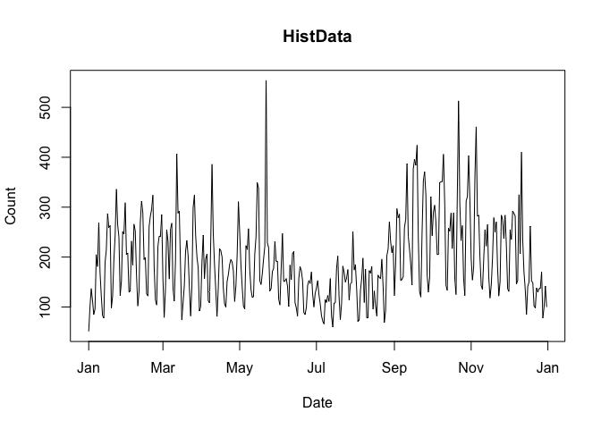
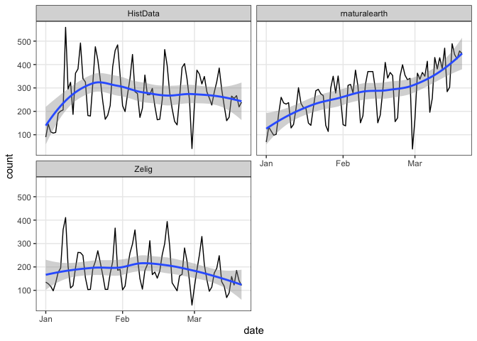
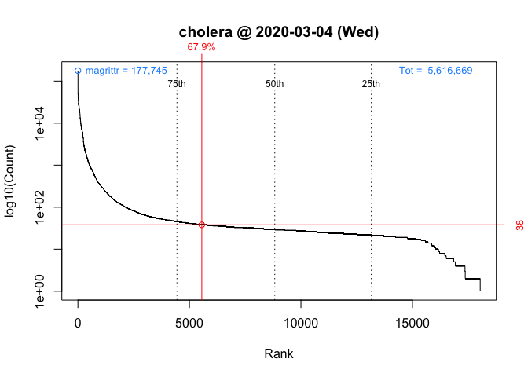

<!-- README.md is generated from README.Rmd. Please edit that file -->

[](https://cran.r-project.org/package=packageRank)
[](https://github.com/lindbrook/packageRank/blob/master/NEWS)
## packageRank: compute and visualize package download counts and rank percentiles

[`'packageRank'`](https://cran.r-project.org/package=packageRank)’ is an
R package that helps put package download counts into context. It does
so via two functions, `cranDownloads()` and `packageRank()`.

`cranDownloads()` extends
[`cranlogs::cran_downloads()`](http://r-hub.github.io/cranlogs/) package
by adding a `plot()` method and a more user-friendly interface to the
task of counting package downloads. `packageRank()` uses rank
percentiles, a nonparametric statistic that tells you the percentage of
packages with fewer downloads, to help you see how your package is doing
compared to all other packages on [CRAN](https://cran.r-project.org/).

NOTE: ‘packageRank’ relies on the ‘cranlogs’ package and requires an
active internet connection. RStudio CRAN logs for the previous day are
generally posted at 18:00 (GMT+1) or 17:00 UTC (GMT+2); results for
functions that rely on ‘cranlogs’ are available soon after.

### I - getting started

To install ‘packageRank’ from CRAN:

``` r
install.packages("packageRank")
```

To install the development version from
GitHub:

``` r
# You may need to first install the 'remotes' via install.packages("remotes").
remotes::install_github("lindbrook/packageRank", build_vignettes = TRUE)
```

### II - computing package download counts

`cranDownloads()` uses all the same arguments as
`cranlogs::cran_downloads()`:

``` r
cranlogs::cran_downloads(packages = "HistData")
>         date count  package
> 1 2020-04-17   378 HistData
```

``` r
cranDownloads(packages = "HistData")
>         date count  package
> 1 2020-04-17   378 HistData
```

The only difference is that `cranDownloads()` adds three features:

#### i) “spell check” package names

``` r
cranDownloads(packages = "GGplot2")
```

    ## Error in cranDownloads(packages = "GGplot2") :
    ##   GGplot2: misspelled or not on CRAN.

<br/>

``` r
cranDownloads(packages = "ggplot2")
>         date count package
> 1 2020-04-17 57652 ggplot2
```

<br/> This also works for inactive packages in the
[Archive](https://cran.r-project.org/src/contrib/Archive):

``` r
cranDownloads(packages = "vr")
```

    ## Error in cranDownloads(packages = "vr") :
    ##  vr: misspelled or not on CRAN/Archive.

<br/>

``` r
cranDownloads(packages = "VR")
>         date count package
> 1 2020-04-17     0      VR
```

<br/>

#### ii) two additional date formats

Beyond its `when` argument (i.e., “last-day”, “last-week”, and
“last-month”), `cranlogs::cran_downloads()` offers `from` and `to`
arguments. These arguments use “yyyy-mm-dd” to specify dates.
`cranDownloads()` adds two additional data formats, “yyyy-mm” or “yyyy”
(yyyy works too\!), which provide convenient and useful shortcuts.

##### “yyyy-mm”

Let’s say you want the June 2019 download counts for
[`'HistData'`](https://cran.r-project.org/package=HistData) . With
`cranlogs::cran_downloads()`, you’d have to type out the whole date and
remember that June has only 30 days:

``` r
cranlogs::cran_downloads(packages = "HistData", from = "2019-06-01",
  to = "2019-06-30")
```

<br/> With `cranDownloads()`, you can just specify the year and month:

``` r
cranDownloads(packages = "HistData", from = "2019-06", to = "2019-06")
```

<br/> “yyyy-mm” will even take care of leap days:

``` r
# 28 observations
cranDownloads(packages = "HistData", from = "2019-02", to = "2019-02")

# 29 observations
cranDownloads(packages = "HistData", from = "2020-02", to = "2020-02")
```

##### “yyyy”

Let’s say you want the year-to-date download counts for
[`'rstan'`](https://cran.r-project.org/package=rstan). With
`cranlogs::cran_downloads()`, you’d type something like:

``` r
cranlogs::cran_downloads(packages = "rstan", from = "2020-01-01",
  to = Sys.Date() - 1)
```

<br/> With `cranDownloads()`, you can just type:

``` r
cranDownloads(packages = "rstan", from = "2020")
```

<br/>

#### iii) check dates

`cranDownloads()` also tries to check for valid dates:

``` r
cranDownloads(packages = "HistData", from = "2019-01-15",
  to = "2019-01-35")
```

    ## Error in resolveDate(to, type = "to") : Not a valid date.

### III - visualizing package downloads

To visualize the data from `cranDownloads()`, use
`plot()`:

``` r
plot(cranDownloads(packages = "HistData", from = "2020"))
```



#### multiple packages

When you pass a vector of package names, `plot()` defaults to using
`ggplot2` facets:

``` r
plot(cranDownloads(packages = c("ggplot2", "data.table", "Rcpp"),
  from = "2020"))
```


<br/> If you want all the data in a single plot, use `multi.plot =
TRUE`:

``` r
plot(cranDownloads(packages = c("ggplot2", "data.table", "Rcpp"),
  from = "2020"), multi.plot = TRUE)
```

<br/> If you want separate plots, use `graphics = "base"` (you’ll be
prompted for each plot):

``` r
plot(cranDownloads(packages = c("ggplot2", "data.table", "Rcpp"),
  from = "2020"), graphics = "base")
```

If you want separate plots, independently scaled, add `y.same.scale =
FALSE`:

``` r
plot(cranDownloads(packages = c("ggplot2", "data.table", "Rcpp"),
  from = "2020"), graphics = "base", y.same.scale = FALSE)
```

#### `packages = NULL`

`cranlogs::cran_download(packages = NULL)` computes the total number of
package downloads from CRAN. You can visualize this by using
cranDownloads() and plot():

``` r
plot(cranDownloads(from = 2019, to = 2019))
```

<!-- -->

#### `packages = "R"`

`cranlogs::cran_download(packages = "R")` computes the total number of
downloads of the R application (note that you can only use “R” or a
vector of packages names, not both\!). You can visualize this by using
cranDownloads() and plot():

``` r
plot(cranDownloads(packages = "R", from = 2019, to = 2019))
```

<!-- -->

#### smoothers and confidence intervals

To add a lowess smoother to your data, use `smooth = TRUE`:

``` r
plot(cranDownloads(packages = "rstan", from = "2019"), smooth = TRUE)
```

<!-- -->

With graphs that use ‘ggplot2’, the `se = TRUE` will add confidence
intervals:

``` r
plot(cranDownloads(packages = c("HistData", "rnaturalearth", "Zelig"), when = "last-month"),
  smooth = TRUE, se = TRUE)
```

<!-- -->

#### package and R release dates

To annotate the graph with the package release
dates:

``` r
plot(cranDownloads(packages = "rstan", from = "2019", to = "2019"), package.version = TRUE)
```

<!-- -->

To annotate the graph with the R release
dates:

``` r
plot(cranDownloads(packages = "rstan", from = "2019", to = "2019"), r.version = TRUE)
```

<!-- -->

#### population plot

To visualize a package’s relative position over
time:

``` r
plot(cranDownloads(packages = "HistData", when = "last-month"), population.plot = TRUE)
```

<!-- -->

This longitudinal view plots the date (x-axis) against the logarithm of
a package’s downloads (y-axis).

In the background, the same variable are plotted (in gray) for a
stratified random sample of packages: within each 5% interval of rank
percentiles (e.g., 0 to 5, 5 to 10, 95 to 100, etc.), a random sample of
5% of packages is selected and tracked over time. This sample
approximates the “typical” pattern of downloads for that time period.

Note: a version for [Bioconductor](https://bioconductor.org/) packages
is not currently available

### IV - computing package download rank percentiles

After looking the download count data for a while, the “compared to
what?” question will quickly come to mind. For instance, consider the
data for the first week of March 2020:

``` r
plot(cranDownloads(packages = "cholera", from = "2020-03-01",
  to = "2020-03-07"))
```


Do the peaks on Wednesday and Saturday represent surges of interest in
the package or surges of traffic to [CRAN](https://cran.r-project.org/)?
To put it more broadly, how can we know if a given download count is
typical or unusual? One way to answer these questions is to locate your
package in the frequency distribution of download counts. Below are the
distributions for Wednesday and Saturday with the location of
[`'cholera'`](https://cran.r-project.org/package=cholera)
highlighted:


Unfortunately, the frequency distribution of package downloads typically
has an exponential and heavily skewed shape. The left side, where
packages with fewer downloads are located, *looks* like a vertical line.
Using Wednesday as an example, this is a consequence of the fact that
the most downloaded package had 177,745 downloads while the least
downloaded package had just 1.

To help see what’s going on, I redraw the plots using the logarithm of
download counts (x-axis). In these plots, a vertical segment’s position
on the x-axis represents its download count while its height represents
the number of packages that have that download
count:

``` r
plot(packageDistribution(package = "cholera", date = "2020-03-04"))
```


``` r
plot(packageDistribution(package = "cholera", date = "2020-03-07"))
```


While these plots give us a better picture of where
[`'cholera'`](https://cran.r-project.org/package=cholera) is located,
any comparison between Wednesday and Saturday is impressionistic at
best: all we can confidently say is that the download counts for both
days were above than the mode.

To address this, I compute the *rank percentile* of download counts.
This nonparametric statistic tells us the percentage of packages with
fewer downloads than your package. By standardizing or normalizing
download counts, we get an easy-to-interpret measure that also gives us
a way to compare Wednesday and
Saturday.

``` r
packageRank(package = "cholera", date = "2020-03-04", size.filter = FALSE)
>         date packages downloads            rank percentile
> 1 2020-03-04  cholera        38 5,556 of 18,038       67.9
```

<br/>

``` r
packageRank(package = "cholera", date = "2020-03-07", size.filter = FALSE)
>         date packages downloads            rank percentile
> 1 2020-03-07  cholera        29 3,061 of 15,950         80
```

On Wednesday, we can see that
[`'cholera'`](https://cran.r-project.org/package=cholera) had 38
downloads and came in 5,556th place out of 18,038 unique packages
downloaded. This earned
[`'cholera'`](https://cran.r-project.org/package=cholera) a spot in the
68th percentile. On Saturday, we can see that
[`'cholera'`](https://cran.r-project.org/package=cholera) had 29
downloads and came in 3,061st place out of 15,950 unique packages
downloaded. This earned
[`'cholera'`](https://cran.r-project.org/package=cholera) a spot in the
80th percentile. So contrary to what the nominal download counts tell
us, one could argue that there was greater interest in
[`'cholera'`](https://cran.r-project.org/package=cholera) on Saturday
than on Wednesday.

#### computing rank percentile

To compute the rank percentile, I tabulate the number of downloads per
package recorded in the log. Then for a given download count, I compute
the percentage of packages with fewer download counts:

To compute the rank percentile, I do the following. For each package I
first tabulate the number of downloads and then compute the percentage
of packages with fewer downloads. Here are the details using
[`'cholera'`](https://cran.r-project.org/package=cholera) from that
Wednesday as an example:

``` r
pkg.rank <- packageRank(packages = "cholera", date = "2020-03-04",
  size.filter = FALSE)

downloads <- pkg.rank$crosstab

round(100 * mean(downloads < downloads["cholera"]), 1)
> [1] 67.9

# OR

(pkgs.with.fewer.downloads <- sum(downloads < downloads["cholera"]))
> [1] 12250

(tot.pkgs <- length(downloads))
> [1] 18038

round(100 * pkgs.with.fewer.downloads / tot.pkgs, 1)
> [1] 67.9
```

For the example above, 51 downloads puts ‘HistData’ in 920th place among
the 14,020 packages downloaded. This rank is “nominal” because multiple
packages can have the same number of downloads. As a result, a package’s
nominal rank (but not its rank percentile) can be affected by its name:
packages with the same number of downloads are sorted in alphabetical
order. Thus, ‘HistData’ benefits from the fact that it is second in the
list of packages with 51 downloads:

``` r
pkg.rank <- packageRank(packages = "HistData", date = "2019-01-01")
downloads <- pkg.rank$crosstab

downloads[downloads == 51]
> 
>  dynamicTreeCut        HistData         modeest  NeuralNetTools   OpenStreetMap 
>              51              51              51              51              51 
>       pkgKitten plotlyGeoAssets         superpc           sweep        webutils 
>              51              51              51              51              51
```

### V - visualizing package download rank percentiles

To visualize `packageRank()`, use
`plot()`.

``` r
plot(packageRank(packages = "cholera", date = "2020-03-04"))
```



<br/>

``` r
plot(packageRank(packages = "cholera", date = "2020-03-07"))
```


These graphs, customized to be on the same scale, plot the rank of the
download count for *all* packages downloaded that day (x-axis) against
the base 10 logarithm of those counts (y-axis). It then highlights your
package’s position in the distribution along with its rank percentile
and download count (in red). In the background, the 75th, 50th and 25th
percentiles are plotted as dotted vertical lines; the package with the
most downloads, which in both cases is
[`'magrittr'`](https://cran.r-project.org/package=magrittr) (in blue,
top left); and the total number of downloads, 5,561,681 and 3,403,969
respectively (in blue, top right).

### VI - filter “small” downloads

`packageRank()` and `packageLog()` have an additional argument,
‘size.filter’ that by removes downloads \< 1000 bytes. Depending on
the day of the week and the number of versions a package has, this can
provide a more accurate count of package downloads (details
forthcoming). For example, here is a raw download
count:

``` r
packageRank(packages = "HistData", date = "2019-10-30", size.filter = FALSE)
>         date packages downloads          rank percentile
> 1 2019-10-30 HistData       403 794 of 17,396       95.4
```

Below is a filtered
count.

``` r
packageRank(packages = "HistData", date = "2019-10-30", size.filter = TRUE)
>         date packages downloads          rank percentile
> 1 2019-10-30 HistData       382 796 of 15,330       94.8
```

Besides a difference of 21 downloads, notice that the number of unique
packages downloaded falls from 17,396 to 15,330.

By default, `size.filter = TRUE` for `packageRank()` and `size.filter =
FALSE` for `packageLog()`.

### VII - memoization

To avoid the bottleneck of downloading multiple log files,
`packageRank()` is currently limited to individual days or observations.
However, to reduce the need to re-download logs for a given day,
‘packageRank’ makes use of memoization via the ‘memoise’ package.

Here’s relevant code:

``` r
fetchLog <- function(url) data.table::fread(url)

mfetchLog <- memoise::memoise(fetchLog)

if (RCurl::url.exists(url)) {
  cran_log <- mfetchLog(url)
}
```

If you use `fetchLog()`, the log file, which can sometimes be as large
as 50 MB, will be downloaded every time you call the function. If you
use `mfetchLog()`, logs are intelligently cached; those that have
already been downloaded, in your current R session, will not be
downloaded again.
