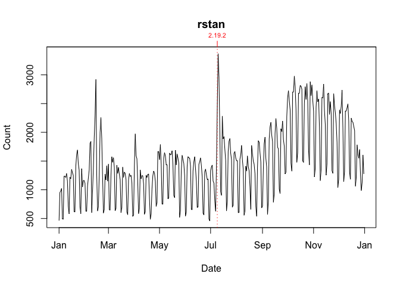

<!-- README.md is generated from README.Rmd. Please edit that file -->
[](https://cran.r-project.org/package=packageRank)
[](https://github.com/lindbrook/packageRank/blob/master/NEWS)
## packageRank: compute and visualize package download counts and rank percentiles

### Features

  - compute and visualize the counts and ranks (nominal and percentile)
    of downloads from RStudio’s [CRAN
    mirror](http://cran-logs.rstudio.com) and
    [Bioconductor](https://bioconductor.org/).
  - compute and visualize a package’s position in the overall
    distribution of download counts for a given day (cross-sectionally)
    or over time (longitudinally).

NOTE: ‘packageRank’ relies on an active internet connection. CRAN logs
are generally updated at 17:00 UTC; results from ‘cranlogs’ based
functions are updated soon after.

### Getting started

To install ‘packageRank’ from CRAN:

``` r
install.packages("packageRank")
```

To install the latest development version from
GitHub:

``` r
# You may need to first install the 'remotes' via install.packages("remotes").
remotes::install_github("lindbrook/packageRank", build_vignettes = TRUE)
```

### I - Background

The ‘[cranlogs](https://cran.r-project.org/package=cranlogs)’ package
computes the number of downloads, packages and R itself, from RStudio’s
[CRAN mirror](http://cran-logs.rstudio.com).

For example, we can see that on the first day of 2019 the
‘[HistData](https://cran.r-project.org/package=HistData)’ package was
downloaded 51
times:

``` r
cranlogs::cran_downloads(packages = "HistData", from = "2019-01-01", to = "2019-01-01")
>         date count  package
> 1 2019-01-01    51 HistData
```

Lurking in the background is the “compared to what?” question. Is 51
downloads large or small? Similarly, if we look at the data from the
first week of 2019, we might wonder whether the pattern we see is
typical or
not:

``` r
cranlogs::cran_downloads(packages = "HistData", from = "2019-01-01", to = "2019-01-07")
>         date count  package
> 1 2019-01-01    51 HistData
> 2 2019-01-02   100 HistData
> 3 2019-01-03   137 HistData
> 4 2019-01-04   113 HistData
> 5 2019-01-05    85 HistData
> 6 2019-01-06    96 HistData
> 7 2019-01-07   205 HistData
```

The objective of ‘packageRank’ is to help answer such questions by
putting these counts into context.

### II - Computation of downloads

To compute package or R downloads, use `cranDownloads()`. In contrast to
`cranlogs::cran_downloads()`, `cranDownloads()` has more convenient
interface: you can pass dates as “yyyy-mm-dd”, “yyyy-mm” or “yyyy”.

``` r
# Downloads from December 31, 2018 through June 25, 2019
cranDownloads(packages = "HistData", from = "2018-12-31", to = "2019-06-25")

# Downloads from June 2015 through June 2019
cranDownloads(packages = "HistData", from = "2015-06", to = "2016-01")

# 2016 to 2019
cranDownloads(packages = "HistData", from = "2015", to = "2019")

# Year-to-date
cranDownloads(packages = "HistData", from = "2019")
```

To compute downloads for multiple packages, pass a character vector of
package names.

``` r
cranDownloads(packages = c("Rcpp", "rlang", "data.table"))
```

### III - Visualization of downloads

When dealing with many observations (e.g., longer time series),
visualization can be especially useful. To do so, simply use
`cranDownloads()`’s plot method:

``` r
# Downloads from December 31, 2018 throught June 25, 2019
plot(cranDownloads(packages = "HistData", from = "2018-12-31", to = "2019-06-25"))
```

<!-- -->

``` r
# Downloads from June 2015 through June 2019
plot(cranDownloads(packages = "HistData", from = "2015-06", to = "2016-01"))
```

<!-- -->

``` r
# 2016 to 2019  (either character or numeric are OK)
plot(cranDownloads(packages = "HistData", from = "2015", to = "2019"))
```

<!-- -->

``` r
# Year-to-date
plot(cranDownloads(packages = "HistData", from = "2019"))
```

<!-- -->

#### multiple packages

When you pass a vector of multiple packages, you’ll get a dot chart for
a single date and a ‘ggplot2’ figure with multiple facets for multiple
dates:

``` r
plot(cranDownloads(packages = c("Rcpp", "rlang", "data.table")))
```

<!-- -->

``` r
plot(cranDownloads(packages = c("Rcpp", "rlang", "data.table"), when = "last-month"))
```

<!-- -->

If you want separate plots for each package, set the graphics argument
to
“base”.

``` r
plot(cranDownloads(packages = c("Rcpp", "rlang", "data.table"), when = "last-month"), graphics = "base")
```

#### smoothers, confidence intervals, and R release dates

You can add a smoother with the ‘smooth’ argument. The ‘r.version’
argument annotates the plot the R release
dates.

``` r
plot(cranDownloads(packages = "rstan", from = "2019"), smooth = TRUE, r.version = TRUE)
```

<!-- -->

With ‘ggplot2’ figures, setting se = TRUE argument adds confidence
intervals.

``` r
plot(cranDownloads(packages = c("HistData", "rnaturalearth", "Zelig"), when = "last-month"), smooth = TRUE,
  se = TRUE)
```

<!-- -->

#### Bioconductor

For Bioconductor packages, use `bioconductorDownloads()`. Note that logs
are aggregated to the month or the calendar year, so dates must either
be “yyyy-mm” or “yyyy”.

``` r
# Downloads from June 2015 through June 2019
plot(bioconductorDownloads(packages = "monocle", from = "2015-06", to = "2019-06"))
```

<!-- -->

``` r

# Year-to-date
plot(bioconductorDownloads(packages = "monocle", from = "2019"))
```

<!-- -->

Because of this aggregation, red squares are used to indicate
in-progress observations.

### IV - Computing percentiles and ranks

One way to put download counts into context is to compute the rank
percentile of a package’s downloads. Such a statistic give us an idea of
a package’s place in the overall distribution of downloads.

``` r
packageRank(packages = "HistData", date = "2019-01-01")
>         date packages downloads percentile          rank
> 1 2019-01-01 HistData        51       93.4 920 of 14,020
```

Here, we see that 51 downloads on January 1, 2019 put ‘HistData’ in the
93rd percentile. This statistic, familiar to anyone who’s taken a
standardized test, tell us that 93% of packages had fewer downloads than
‘HistData’.

Because packages with zero downloads are not recorded in the log, there
is a potential censoring problem. However, my analysis indicates that
the number of CRAN packages (not in the archive) without any downloads
on a given day is actually pretty small. Also, a significant number of
packages (50% not unusual) in the archive (not on CRAN) are regularly
downloaded.

#### computing rank percentile

``` r
pkg.rank <- packageRank(packages = "HistData", date = "2019-01-01")
downloads <- pkg.rank$crosstab

round(100 * mean(downloads < downloads["HistData"]), 1)
> [1] 93.4

# OR

(pkgs.with.fewer.downloads <- sum(downloads < downloads["HistData"]))
> [1] 13092

(tot.pkgs <- length(downloads))
> [1] 14020

round(100 * pkgs.with.fewer.downloads / tot.pkgs , 1)
> [1] 93.4
```

We also see that 51 downloads put ‘HistData’ in 920th place among the
14,020 packages with at least one download. This rank is “nominal”
because multiple packages can have the same number of downloads. As a
result, a package’s nominal rank (but not its rank percentile) can be
affected by its names: packages with the same number of downloads are
sorted in alphabetical order. For the case at hand, ‘HistData’ benefits
from the fact that it is second in the list of packages with 51
downloads:

``` r
pkg.rank <- packageRank(packages = "HistData", date = "2019-01-01")
downloads <- pkg.rank$crosstab

downloads[downloads == 51]
> 
>  dynamicTreeCut        HistData          kimisc  NeuralNetTools 
>              51              51              51              51 
>   OpenStreetMap       pkgKitten plotlyGeoAssets            spls 
>              51              51              51              51 
>        webutils            zoom 
>              51              51
```

For Bioconductor packages, use bioconductorRank():

``` r
bioconductorRank(packages = "cicero", date = "2019-09")
>      date packages downloads percentile         rank
> 1 2019-09   cicero       171       77.3 434 of 1,913
```

#### warning message

With R \>= 3.6, you’re likely to see a warning message the first time
you run either ‘packageRank()’ or ‘bioconductorRank()’:

    Registered S3 method overwritten by 'R.oo':
      method        from
      throw.default R.methodsS3

This is a consequence of an upstream, higher-order package dependency.
For more information, see [R.methodsS3,
Issue 15](https://github.com/HenrikBengtsson/R.methodsS3/issues/15) and
[R.utils,
Issue 95](https://github.com/HenrikBengtsson/R.utils/issues/95) on
Henrik Bengtsson’s GitHub pages for details.

### V - Visualizing percentiles and ranks (cross-sectional)

To visualize the rank percentile, use `packageRank()`’s plot
method:

``` r
plot(packageRank(packages = "HistData", date = "2019-01-01"))
```


This provides a cross-sectional view which plots a package’s rank
(x-axis) against the base 10 logarithm of its downloads (y-axis), and
highlights its position in the overall distribution of downloads. In
addition, the plot illustrates 1) a package’s rank percentile and raw
count of downloads (in red); 2) the location of the 75th, 50th and 25th
percentiles (dotted gray vertical lines); 3) the package with the most
downloads, in this case ‘WGCNA’ (in blue, top left); and 4) the total
number of downloads (2,982,767 for CRAN) (in blue, top right).

You can also pass a vector of
packages:

``` r
plot(packageRank(packages = c("cholera", "HistData", "regtools"), date = "2019-01-01"))
```


You can also use this with
bioconductorRank():

``` r
plot(bioconductorRank(packages = "cicero", date = "2019-01"))
```


### VI - Visualizing percentiles and ranks (longitudinal)

To visualize a package’s relative position over time, use
`packageRankTime()`:

``` r
plot(packageRankTime(packages = "HistData", when = "last-month"), graphics_pkg = "base")
```


This longitudinal view plots the date (x-axis) against the logarithm of
a package’s downloads (y-axis).

In the background, the same variable are plotted (in gray) for a
stratified random sample of packages: within each 5% interval of rank
percentiles (e.g., 0 to 5, 5 to 10, 95 to 100, etc.), a random sample of
5% of packages is selected and tracked over time. This sample
approximates the “typical” pattern of package downloads for that time
period.

Note that for this function, only two time frames are currently
available: “last-week” and “last-month”. Also, a version for
[Bioconductor](https://bioconductor.org/) packages is not currently
available.

### VII Graphics: base R and ‘ggplot2’

All plot are available as both base R and ‘ggplot2’ graphs. By default,
plots with single frame/panels (one package or one day) use base
graphics while those with multiple frames/panels use ‘ggplot2’. You can
override these defaults by using the “graphics” argument in the plot()
method.

### VIII - Memoization

To avoid the bottleneck of downloading multiple log files,
`packageRank()` is limited to individual days. However, to reduce the
need to re-download logs for a given day, ‘packageRank’ makes use of
memoization via the ‘memoise’ package.

Here’s relevant code:

``` r
fetchLog <- function(x) data.table::fread(x)

mfetchLog <- memoise::memoise(fetchLog)

if (RCurl::url.exists(url)) {
  cran_log <- mfetchLog(url)
}
```

If you use `fetchLog()`, the log file, which can sometimes be as large
as 50 MB, will be downloaded every time you call the function. If you
use `mfetchLog()`, logs are intelligently cached; those that have
already been downloaded, in your current R session, will not be
downloaded again.
