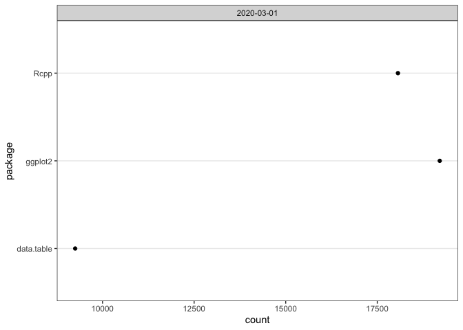
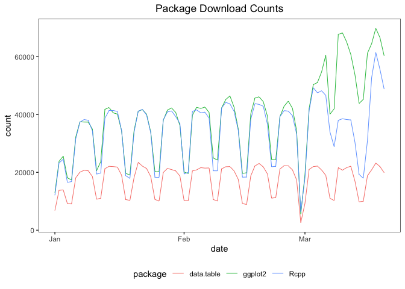
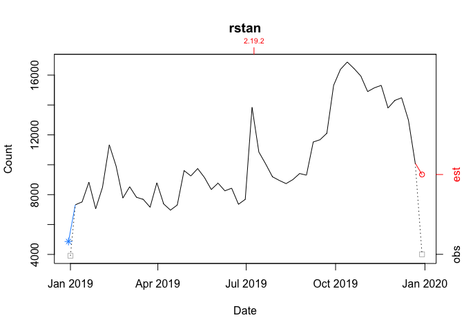
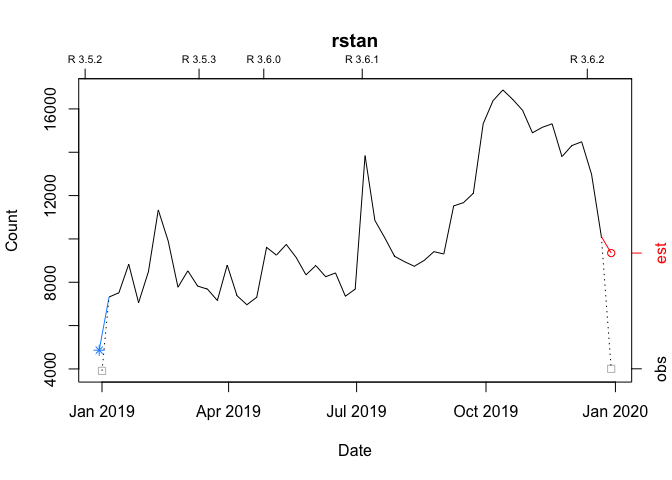
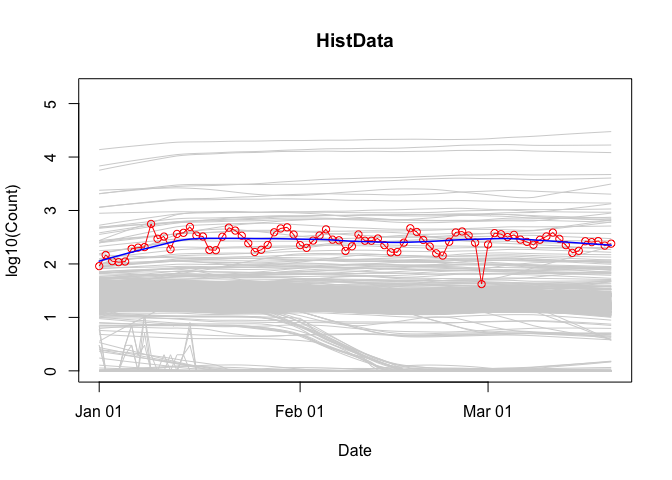

<!-- README.md is generated from README.Rmd. Please edit that file -->

## packageRank: compute and visualize package download counts and rank percentiles

[‘packageRank’](https://CRAN.R-project.org/package=packageRank) is an R
package that helps put package download counts into context. It does so
via two core functions, `cranDownloads()` and `packageRank()`, a set of
filters that reduces package download count inflation, and other
assorted functions that help you assess interest in your package.

I discuss these topics in four sections; a fifth discusses package
related issues.

-   [I Package Download Counts](#i---computing-package-download-counts)
    describes how `cranDownloads()` extends the functionality of
    [`cranlogs::cran_downloads()`](https://r-hub.github.io/cranlogs/) by
    adding a more user-friendly interface and by providing a generic R
    `plot()` method that makes visualization easy.
-   [II Package Download Rank
    Percentiles](#ii---computing-package-download-rank-percentiles)
    describes how `packageRank()` uses rank percentiles, a nonparametric
    statistic that tells you the percentage of packages with fewer
    downloads, to help you see how your package is doing relative to
    *all* other [CRAN](https://CRAN.R-project.org/) packages.
-   [III Package Download
    Filters](#iii---filtering-package-download-counts) describes the
    functions that filter out software and behavioral artifacts from the
    download logs which contribute to inflated download counts.
-   [IV Other Functions](#iv---other-functions) describes six other
    [‘packageRank’](https://CRAN.R-project.org/package=packageRank)
    functions that help you better understand interest in your package.
-   [V Notes](#v---notes) discusses issues associated with country code
    top-level domains, memoization, time zone effects, and the internet
    connection time out problem.

### getting started

To install
[‘packageRank’](https://cran.r-project.org/package=packageRank) from
CRAN:

``` r
install.packages("packageRank")
```

To install the development version from GitHub:

``` r
# You may need to first install 'remotes' via install.packages("remotes").
remotes::install_github("lindbrook/packageRank", build_vignettes = TRUE)
```

Note that
[‘packageRank’](https://CRAN.R-project.org/package=packageRank) has two
upstream online dependencies: 1) RStudio’s [CRAN package download
logs](http://cran-logs.rstudio.com/), which records traffic to the
“0-Cloud” mirror at cloud.r-project.org (formerly RStudio’s CRAN
mirror); and 2) Gábor Csárdi’s
[‘cranlogs’](https://CRAN.R-project.org/package=cranlogs) R package,
which is an interface to a database that computes R and R package
download counts using the aforementioned logs.

When everything is working right, the [CRAN package download
logs](http://cran-logs.rstudio.com/) for the *previous* day will be
posted by 17:00 UTC and the results for
[‘cranlogs’](https://CRAN.R-project.org/package=cranlogs) will be
available soon after. However, occasionally problems with “today’s” data
can emerge due to the downstream nature of the dependencies (illustrated
below).

    CRAN Download Logs --> 'cranlogs' --> 'packageRank'

If there’s a problem with the [logs](http://cran-logs.rstudio.com/)
(e.g., they’re not posted on time), both
[‘cranlogs’](https://CRAN.R-project.org/package=cranlogs) and
[‘packageRank’](https://CRAN.R-project.org/package=packageRank) will be
affected. Here, depending on the function you’ll see things like an
unexpected zero count(s) for your package(s) (actually, it’s zero
downloads for all of CRAN), data from “yesterday”, or a “Log is not
(yet) on the server” error message.

If there’s a problem with
[‘cranlogs’](https://CRAN.R-project.org/package=cranlogs) but not with
the [logs](http://cran-logs.rstudio.com/), only
packageRank::cranDownalods() will be affected (the zero downloads
problem). All the other
[‘packageRank’](https://CRAN.R-project.org/package=packageRank)
functions should work since they directly access the logs.

Usually, these errors resolve themselves the next time the underlying
scripts are run (typically “tomorrow”, if not sooner).

### I - computing package download counts

`cranDownloads()` uses all the same arguments as
`cranlogs::cran_downloads()`:

``` r
cranlogs::cran_downloads(packages = "HistData")
```

    >         date count  package
    > 1 2020-05-01   338 HistData

The only difference is that `cranDownloads()` adds four features:

#### i) “spell check” for package names

``` r
cranDownloads(packages = "GGplot2")
```

    ## Error in cranDownloads(packages = "GGplot2") :
    ##   GGplot2: misspelled or not on CRAN.

<br/>

``` r
cranDownloads(packages = "ggplot2")
```

    >         date count cumulative package
    > 1 2020-05-01 56357      56357 ggplot2

<br/> This also works for inactive or “retired” packages in the
[Archive](https://CRAN.R-project.org/src/contrib/Archive/):

``` r
cranDownloads(packages = "vr")
```

    ## Error in cranDownloads(packages = "vr") :
    ##  vr: misspelled or not on CRAN/Archive.

<br/>

``` r
cranDownloads(packages = "VR")
```

    >         date count cumulative package
    > 1 2020-05-01    11         11      VR

<br/>

#### ii) two additional date formats

With `cranlogs::cran_downloads()`, you specify a time frame using the
`from` and `to` arguments. The downside of this is that you *must* use
the “yyyy-mm-dd” date format. For convenience’s sake, `cranDownloads()`
also allows you to use “yyyy-mm” or “yyyy” (yyyy also works).

##### “yyyy-mm”

Let’s say you want the download counts for
[‘HistData’](https://CRAN.R-project.org/package=HistData) for February
2020. With `cranlogs::cran_downloads()`, you’d have to type out the
whole date and remember that 2020 was a leap year:

``` r
cranlogs::cran_downloads(packages = "HistData", from = "2020-02-01",
  to = "2020-02-29")
```

<br/> With `cranDownloads()`, you can just specify the year and month:

``` r
cranDownloads(packages = "HistData", from = "2020-02", to = "2020-02")
```

##### “yyyy” or yyyy

Let’s say you want the year-to-date download counts for
[‘rstan’](https://CRAN.R-project.org/package=rstan). With
`cranlogs::cran_downloads()`, you’d type something like:

``` r
cranlogs::cran_downloads(packages = "rstan", from = "2022-01-01",
  to = Sys.Date() - 1)
```

<br/> With `cranDownloads()`, you can use:

``` r
cranDownloads(packages = "rstan", from = "2022")
```

or

``` r
cranDownloads(packages = "rstan", from = 2022)
```

<br/>

#### iii) check date validity

``` r
cranDownloads(packages = "HistData", from = "2019-01-15",
  to = "2019-01-35")
```

    ## Error in resolveDate(to, type = "to") : Not a valid date.

#### iv) cumulative count

``` r
cranDownloads(packages = "HistData", when = "last-week")
```

    >         date count cumulative  package
    > 1 2020-05-01   338        338 HistData
    > 2 2020-05-02   259        597 HistData
    > 3 2020-05-03   321        918 HistData
    > 4 2020-05-04   344       1262 HistData
    > 5 2020-05-05   324       1586 HistData
    > 6 2020-05-06   356       1942 HistData
    > 7 2020-05-07   324       2266 HistData

<br/>

### visualizing package download counts

`cranDownloads()` makes visualizing package downloads easy. Just use
`plot()`:

``` r
plot(cranDownloads(packages = "HistData", from = "2019", to = "2019"))
```


If you pass a vector of package names for a single day, `plot()` returns
a dotchart:

``` r
plot(cranDownloads(packages = c("ggplot2", "data.table", "Rcpp"),
  from = "2020-03-01", to = "2020-03-01"))
```



If you pass a vector of package names for multiple days, `plot()` uses
`ggplot2` facets:

``` r
plot(cranDownloads(packages = c("ggplot2", "data.table", "Rcpp"),
  from = "2020", to = "2020-03-20"))
```


<br/>

If you want to plot those data in a single frame, set
`multi.plot = TRUE`:

``` r
plot(cranDownloads(packages = c("ggplot2", "data.table", "Rcpp"),
  from = "2020", to = "2020-03-20"), multi.plot = TRUE)
```

<!-- -->

<br/> If you want plot those data in separate plots but use the same
scale, set `graphics = "base"` (you’ll be prompted for each plot):

``` r
plot(cranDownloads(packages = c("ggplot2", "data.table", "Rcpp"),
  from = "2020", to = "2020-03-20"), graphics = "base")
```

If you want do the above on separate independent scales, set
`same.xy = FALSE`:

``` r
plot(cranDownloads(packages = c("ggplot2", "data.table", "Rcpp"),
  from = "2020", to = "2020-03-20"), graphics = "base", same.xy = FALSE)
```

#### unit of observation

If you want to visualize the data from a unit of observation other than
the default (“day”), pass “month”, or “year” to the `unit.observation`
argument. For example, below is the plot for the daily downloads of
[‘HistData’](https://CRAN.R-project.org/package=HistData) from January
2021 through December 15 2021.

``` r
plot(cranDownloads(packages = "HistData", from = "2021", to = "2021-12-15"))
```

<!-- -->

Here is the plot for the same data aggregated by month:

``` r
plot(cranDownloads(packages = "HistData", from = "2021", to = "2021-12-15"), unit.observation = "month")
```

<!-- -->

There are three things to notice with these aggregated plots. First, if
an aggregate observation is still in-progress (e.g., in the plot above,
we’ve only seen the first half of December), that observation is split
into two separate points: 1) a “grayed-out” point for the in-progress or
observed total (the black empty square) and 2) a highlighted point for
the projected or estimated total (the red empty circle). The estimate is
based on how much the unit of observation is completed. In the plot
above, there are 2,708 downloads between December 1 and December 15.
Thus, the estimate for the whole month is 5,597 or 31 / 15 \* 2708.
Second, all other points represents the total count at the end of an
aggregate period. For example, the first solid point, on the far left,
records the total download count for the month January and is plotted on
January 31. Third, if you include a smoother, using the `smooth = TRUE`
argument, the curve only uses complete, not in-progress, data.

#### logarithm of download counts

To use the base 10 logarithm of the download count in a plot, set
`log.count = TRUE`:

``` r
plot(cranDownloads(packages = "HistData", from = "2021", to = "2021-12-15"), log.count = TRUE)
```

<!-- -->

#### `packages = NULL`

`cranlogs::cran_download(packages = NULL)` computes the total number of
package downloads from CRAN. You can plot these data by using:

``` r
plot(cranDownloads(from = 2019, to = 2019))
```

<!-- -->

#### `packages = "R"`

`cranlogs::cran_download(packages = "R")` computes the total number of
downloads of the R application (note that you can only use “R” or a
vector of packages names, not both!). You can plot these data by using:

``` r
plot(cranDownloads(packages = "R", from = 2019, to = 2019))
```

<!-- -->

If you want the total count of R downloads, set `r.total = TRUE`:

``` r
plot(cranDownloads(packages = "R", from = 2019, to = 2019), r.total = TRUE)
```

#### smoothers and confidence intervals

To add a lowess smoother to your plot, use `smooth = TRUE`:

``` r
plot(cranDownloads(packages = "rstan", from = "2019", to = "2019"),
  smooth = TRUE)
```

<!-- -->

With graphs that use ‘ggplot2’, `se = TRUE` will add confidence
intervals:

``` r
plot(cranDownloads(packages = c("HistData", "rnaturalearth", "Zelig"),
  from = "2020", to = "2020-03-20"), smooth = TRUE, se = TRUE)
```

<!-- -->

#### package and R release dates

To annotate a graph with a package’s release dates:

``` r
plot(cranDownloads(packages = "rstan", from = "2019", to = "2019"),
  package.version = TRUE)
```

<!-- -->

To annotate a graph with R release dates:

``` r
plot(cranDownloads(packages = "rstan", from = "2019", to = "2019"),
  r.version = TRUE)
```

<!-- -->

#### plot growth curves (cumulative download counts)

To plot growth curves, set `statistic = "cumulative"`:

``` r
plot(cranDownloads(packages = c("ggplot2", "data.table", "Rcpp"),
  from = "2020", to = "2020-03-20"), statistic = "cumulative",
  multi.plot = TRUE, points = FALSE)
```

<!-- -->

#### population plot

To visualize a package’s downloads relative to “all” other packages over
time:

``` r
plot(cranDownloads(packages = "HistData", from = "2020", to = "2020-03-20"),
  population.plot = TRUE)
```

<!-- -->

This longitudinal view of package downloads plots the date (x-axis)
against the base 10 logarithm of the selected package’s downloads
(y-axis). To get a sense of how the selected package’s performance
stacks up against all other packages, a set of smoothed curves
representing a stratified random sample of packages is plotted in gray
in the background (the “typical” pattern of downloads on CRAN for the
selected time period). Specifically, within each 5% interval of rank
percentiles (e.g., 0 to 5, 5 to 10, 95 to 100, etc.), a random sample of
5% of packages is selected and tracked.

### II - computing package download rank percentiles

After spending some time with nominal download counts, the “compared to
what?” question will come to mind. For instance, consider the data for
the ‘cholera’ package from the first week of March 2020:

``` r
plot(cranDownloads(packages = "cholera", from = "2020-03-01",
  to = "2020-03-07"))
```


Do Wednesday and Saturday reflect surges of interest in the package or
surges of traffic to [CRAN](https://CRAN.R-project.org/)? To put it
differently, how can we know if a given download count is typical or
unusual? One way to answer these questions is to locate your package in
the overall frequency distribution of download counts.

Below are the distributions of logarithm of download counts for
Wednesday and Saturday. Each vertical segment (along the x-axis)
represents a download count. The height of a segment represents that
download count’s frequency. The location of
[‘cholera’](https://CRAN.R-project.org/package=cholera) in the
distribution is highlighted in red.

``` r
plot(packageDistribution(package = "cholera", date = "2020-03-04"))
```


``` r
plot(packageDistribution(package = "cholera", date = "2020-03-07"))
```


While these plots give us a better picture of where
[‘cholera’](https://CRAN.R-project.org/package=cholera) is located,
comparisons between Wednesday and Saturday are impressionistic at best:
all we can confidently say is that the download counts for both days
were greater than the mode.

To facilitate interpretation and comparison, I use the *rank percentile*
of a download count instead of the simple nominal download count. This
nonparametric statistic tells you the percentage of packages that had
fewer downloads. In other words, it gives you the location of your
package relative to the locations of all other packages. More
importantly, by rescaling download counts to lie on the bounded interval
between 0 and 100, rank percentiles make it easier to compare packages
within and across distributions.

For example, we can compare Wednesday (“2020-03-04”) to Saturday
(“2020-03-07”):

``` r
packageRank(package = "cholera", date = "2020-03-04")
>         date packages downloads            rank percentile
> 1 2020-03-04  cholera        38 5,556 of 18,038       67.9
```

On Wednesday, we can see that
[‘cholera’](https://CRAN.R-project.org/package=cholera) had 38
downloads, came in 5,556th place out of the 18,038 different packages
downloaded, and earned a spot in the 68th percentile.

``` r
packageRank(package = "cholera", date = "2020-03-07")
>         date packages downloads            rank percentile
> 1 2020-03-07  cholera        29 3,061 of 15,950         80
```

On Saturday, we can see that
[‘cholera’](https://CRAN.R-project.org/package=cholera) had 29
downloads, came in 3,061st place out of the 15,950 different packages
downloaded, and earned a spot in the 80th percentile.

So contrary to what the nominal counts tell us, one could say that the
interest in [‘cholera’](https://CRAN.R-project.org/package=cholera) was
actually greater on Saturday than on Wednesday.

#### computing rank percentile

To compute rank percentiles, I do the following. For each package, I
tabulate the number of downloads and then compute the percentage of
packages with fewer downloads. Here are the details using
[‘cholera’](https://CRAN.R-project.org/package=cholera) from Wednesday
as an example:

``` r
pkg.rank <- packageRank(packages = "cholera", date = "2020-03-04")

downloads <- pkg.rank$freqtab

round(100 * mean(downloads < downloads["cholera"]), 1)
> [1] 67.9
```

To put it differently:

``` r
(pkgs.with.fewer.downloads <- sum(downloads < downloads["cholera"]))
> [1] 12250

(tot.pkgs <- length(downloads))
> [1] 18038

round(100 * pkgs.with.fewer.downloads / tot.pkgs, 1)
> [1] 67.9
```

#### nominal ranks

In the example above, 38 downloads puts ‘cholera’ in 5,556th place among
18,038 observed packages. This rank is “nominal” because it’s possible
that multiple packages can have the same number of downloads. As a
result, a package’s nominal rank but not its rank percentile can be
affected by its name. For example, because packages with the same number
of downloads are sorted in alphabetical order, ‘cholera’ benefits from
the fact that it is 31st in the list of 263 packages with 38 downloads:

``` r
pkg.rank <- packageRank(packages = "cholera", date = "2020-03-04")
downloads <- pkg.rank$freqtab

which(names(downloads[downloads == 38]) == "cholera")
> [1] 31
length(downloads[downloads == 38])
> [1] 263
```

### visualizing package download rank percentiles

To visualize `packageRank()`, use `plot()`.

``` r
plot(packageRank(packages = "cholera", date = "2020-03-04"))
```


<br/>

``` r
plot(packageRank(packages = "cholera", date = "2020-03-07"))
```


These graphs above, which are customized here to be on the same scale,
plot the *rank order* of packages’ download counts (x-axis) against the
logarithm of those counts (y-axis). It then highlights (in red) a
package’s position in the distribution along with its rank percentile
and download count. In the background, the 75th, 50th and 25th
percentiles are plotted as dotted vertical lines. The package with the
most downloads,
[‘magrittr’](https://CRAN.R-project.org/package=magrittr) in both cases,
is at top left (in blue). The total number of downloads is at the top
right (in blue).

### III - filtering package download counts

We compute the number of package downloads by simply counting log
entries. While straightforward, this approach can run into problems.
Putting aside the question of whether package dependencies should be
counted, what I have in mind here is what I believe to be two types of
“invalid” log entries. The first, a software artifact, stems from
entries that are smaller, often orders of magnitude smaller, than a
package’s actual binary or source file. The second, a behavioral
artifact, emerges from efforts to download all of
[CRAN](https://cran.r-project.org/). In both cases, a reliance on
nominal counts will give you an inflated sense of the degree of interest
in your package. For those interested, an early but detailed analysis
and discussion of both types of inflation is included as part of this
[R-hub blog
post](https://blog.r-hub.io/2020/05/11/packagerank-intro/#inflationary-bias-of-download-counts).

#### software artifacts

When looking at package download logs, the first thing you’ll notice are
wrongly sized log entries. They come in two sizes. The “small” entries
are approximately 500 bytes in size. The “medium” entries are variable
in size: they fall somewhere between a “small” entry and a full download
(i.e., “small” \<= “medium” \<= full download). “Small” entries manifest
themselves as standalone entries, paired with a full download, or as
part of a triplet along side a “medium” and a full download. “Medium”
entries manifest themselves as either standalone entries or as part of a
triplet.

The example below illustrates a triplet:

``` r
packageLog(date = "2020-07-01")[4:6, -(4:6)]
>               date     time    size package version country ip_id
> 3998633 2020-07-01 07:56:15   99622 cholera   0.7.0      US  4760
> 3999066 2020-07-01 07:56:15 4161948 cholera   0.7.0      US  4760
> 3999178 2020-07-01 07:56:15     536 cholera   0.7.0      US  4760
```

The “medium” entry is the first observation (99,622 bytes). The full
download is the second entry (4,161,948 bytes). The “small” entry is the
last observation (536 bytes). At a minimum, what makes a triplet a
triplet (or a pair a pair) is that all members share system
configuration (e.g. IP address, etc.) and have identical or adjacent
time stamps.

To deal with the inflationary effect of “small” entries, I filter out
observations smaller than 1,000 bytes (the smallest package on CRAN
appears to be
[‘source.gist’](https://cran.r-project.org/package=source.gist), which
weighs in at 1,200 bytes). “Medium” entries are harder to handle. I
remove them using either a triplet-specific filter or a filter that
looks up a package’s actual size.

#### behavioral artifacts

While wrongly sized entries are fairly easy to spot, seeing the effect
of efforts to download all of [CRAN](https://cran.r-project.org/)
require a change of perspective. While details and further evidence can
be found in the [R-hub blog
post](https://blog.r-hub.io/2020/05/11/packagerank-intro/#inflationary-bias-of-download-counts)
mentioned above, I’ll illustrate the problem with the following example:

``` r
packageLog(packages = "cholera", date = "2020-07-31")[8:14, -(4:6)]
```

    >              date     time    size package version country ip_id
    > 132509 2020-07-31 21:03:06 3797776 cholera   0.2.1      US    14
    > 132106 2020-07-31 21:03:07 4285678 cholera   0.4.0      US    14
    > 132347 2020-07-31 21:03:07 4109051 cholera   0.3.0      US    14
    > 133198 2020-07-31 21:03:08 3766514 cholera   0.5.0      US    14
    > 132630 2020-07-31 21:03:09 3764848 cholera   0.5.1      US    14
    > 133078 2020-07-31 21:03:11 4275831 cholera   0.6.0      US    14
    > 132644 2020-07-31 21:03:12 4284609 cholera   0.6.5      US    14

Here, we see that seven different versions of the package were
downloaded as a sequential bloc. A little digging shows that these seven
versions represent *all* versions of ‘cholera’ available on that date:

``` r
packageHistory(package = "cholera")
```

    >   Package Version       Date Repository
    > 1 cholera   0.2.1 2017-08-10    Archive
    > 2 cholera   0.3.0 2018-01-26    Archive
    > 3 cholera   0.4.0 2018-04-01    Archive
    > 4 cholera   0.5.0 2018-07-16    Archive
    > 5 cholera   0.5.1 2018-08-15    Archive
    > 6 cholera   0.6.0 2019-03-08    Archive
    > 7 cholera   0.6.5 2019-06-11    Archive
    > 8 cholera   0.7.0 2019-08-28       CRAN

While there are “legitimate” reasons for downloading past versions
(e.g., research, container-based software distribution, etc.), I’d argue
that examples like the above are “fingerprints” of efforts to download
[CRAN](https://cran.r-project.org/). While this is not necessarily
problematic, it does mean that when your package is downloaded as part
of such efforts, that download is more a reflection of an interest in
[CRAN](https://cran.r-project.org/) itself (a collection of packages)
than of an interest in your package *per se*. And since one of the uses
of counting package downloads is to assess interest in *your* package,
it may be useful to exclude such entries.

To do so, I try to filter out these entries in two ways. The first
identifies IP addresses that download “too many” packages and then
filters out *campaigns*, large blocs of downloads that occur in (nearly)
alphabetical order. The second looks for campaigns not associated with
“greedy” IP addresses and filters out sequences of past versions
downloaded in a narrowly defined time window.

#### example usage

To get an idea of how inflated your package’s download count may be, use
`filteredDownloads()`. Below are the results for ‘ggplot2’ for 15
September 2021.

``` r
filteredDownloads(package = "ggplot2", date = "2021-09-15")
>         date package downloads filtered.downloads inflation
> 1 2021-09-15 ggplot2    113842              57951     96.45
```

While there were 113,842 nominal downloads, applying all the filters
reduced that number to 57,951, an inflation of 96%.

Note that the filters are computationally demanding. Excluding the time
it takes to download the log file, the filters in the above example take
approximate 75 seconds to run using parallelized code (currently only
available on macOS and Unix) on a 3.1 GHz Dual-Core Intel Core i5
processor.

There are 5 filters. You can control them using the following arguments
(listed in order of application):

-   `ip.filter`: removes campaigns of “greedy” IP addresses.
-   `triplet.filter`: reduces triplets to a single observation.
-   `small.filter`: removes entries smaller than 1,000 bytes.
-   `sequence.filter`: removes blocs of past versions.
-   `size.filter`: removes entries smaller than a package’s binary or
    source file.

These filters are off by default (e.g., ip.filter = FALSE). To apply
them, set the argument for the filter you want to TRUE:

``` r
packageRank(package = "cholera", small.filter = TRUE)
```

Alternatively, you can simply set `all.filters = TRUE`.

``` r
packageRank(package = "cholera", all.filters = TRUE)
```

Note that the `all.filters = TRUE` is contextual. Depending on the
function used, you’ll either get the CRAN-specific or the
package-specific set of filters. The former sets `ip.filter = TRUE` and
`size.filter = TRUE`; it works independently of packages at the level of
the entire log. The latter sets `triplet.filter = TRUE`,
`sequence.filter = TRUE` and `size.filter TRUE`; it relies on package
specific information (e.g., size of source or binary file).

Ideally, we’d like to use both sets. However, the package-specific set
is computationally expensive because they need to be applied
individually to all packages in the log, which can involve tens of
thousands of packages. While not unfeasible, currently this takes a long
time. For this reason, when `all.filters = TRUE`, `packageRank()`,
`ipPackage()`, `countryPackage()`, `countryDistribution()` and
`packageDistribution()` use only CRAN specific filters while
`packageLog()`, `packageCountry()`, and `filteredDownloads()` use both
CRAN and package specific filters.

### IV - other functions

Six other functions (some used above) may be of interest: 1)
`packageDistribution()` plots the location of your package in the
overall frequency distribution of package downloads; 2)
`packageHistory()` retrieves your package”s release history; 3)
`packageLog()` extracts your package’s entries from the CRAN download
counts log; 4) `filteredDownloads()` computes an estimate of your
package’s download count inflation (computationally intensive!) and 5 &
6) `bioconductorDownloads()` and `bioconductorRank()` offer analogous
but limited functionality to the two primary functions.

### V - notes

#### country codes (top level domains)

While IP addresses are anonymized, `packageCountry()` and
`countryPackage()` make use of the fact that the logs provide
corresponding ISO country codes or top level domains (e.g., AT, JP, US).
Note that coverage extends to about 85% of observations (i.e.,
approximately 15% country codes are NA). Also, for what it’s worth,
there seems to be a a couple of typos for country codes: “A1” (A +
number one) and “A2” (A + number 2). According to [RStudio’s
documentation](http://cran-logs.rstudio.com/), this coding was done
using MaxMind’s free database, which no longer seems to be available and
may be a bit out of date.

#### memoization

To avoid the bottleneck of downloading multiple log files,
`packageRank()` is currently limited to individual calendar dates. To
reduce the bottleneck of re-downloading logs, which can be upwards of 50
MB, [‘packageRank’](https://CRAN.R-project.org/package=packageRank)
makes use of memoization via the
[‘memoise’](https://CRAN.R-project.org/package=memoise) package.

Here’s relevant code:

``` r
fetchLog <- function(url) data.table::fread(url)

mfetchLog <- memoise::memoise(fetchLog)

if (RCurl::url.exists(url)) {
  cran_log <- mfetchLog(url)
}

# Note that data.table::fread() relies on R.utils::decompressFile().
```

This means that logs are intelligently cached; those that have already
been downloaded in your current R session will not be downloaded again.

#### time zones

The calendar date (e.g. “2021-01-01”) is the unit of observation for
[‘packageRank’](https://CRAN.R-project.org/package=packageRank)
functions. However, because the typical use case involves the *latest*
log file, time zone differences can come into play.

Let’s say that it’s 09:01 on 01 January 2021 and you want to compute the
rank percentile for [‘ergm’](https://CRAN.R-project.org/package=ergm)
for the last day of 2020. You might be tempted to use the following:

``` r
packageRank(packages = "ergm")
```

However, depending on *where* you make this request, you may not get the
data you expect. In Honolulu, USA, you will but in Sydney, Australia you
won’t. The reason is that you’ve somehow forgotten a key piece of
trivia: RStudio typically posts yesterday’s log around 17:00 UTC the
following day.

The expression works in Honolulu because 09:01 HST on 01 January 2021 is
19:01 UTC 01 January 2021. So the log you want has been available for 2
hours. The expression fails in Sydney because 09:01 AEDT on 01 January
2021 is 31 December 2020 22:00 UTC. The log you want won’t actually be
available for another 19 hours.

To make life a little easier,
[‘packageRank’](https://CRAN.R-project.org/package=packageRank) does two
things. First, when the log for the date you want is not available (due
to time zone rather than server issues), you’ll just get the last
available log. If you specified a date in the future, you’ll either get
an error message or a warning that provides an estimate of when that log
should be available.

Using the Sydney example and the expression above, you’d get the results
for 30 December 2020:

``` r
packageRank(packages = "ergm")
```

    >         date packages downloads          rank percentile
    > 1 2020-12-30     ergm       292 873 of 20,077       95.6

If you had specified the date, you’d get an additional warning:

``` r
packageRank(packages = "ergm", date = "2021-01-01")
```

    >         date packages downloads          rank percentile
    > 1 2020-12-30     ergm       292 873 of 20,077       95.6

    Warning message:
    2020-12-31 log arrives in appox. 19 hours at 02 Jan 04:00 AEDT. Using last available!

Second, to help you check/remember when logs are posted in your
location, there’s `logDate()` and `logPostInfo()`. The former silently
returns the date of the current available log. The latter adds the
approximate local and UTC times when logs of the desired date are posted
to RStudio’s server.

Here’s what you’d see using the Honolulu example:

``` r
logDate()
```

    > [1] "2021-01-01

and

``` r
logPostInfo()
```

    > $log.date
    > [1] "2021-01-01"
    >
    > $GMT
    > [1] "2021-01-01 17:00:00 GMT"
    >
    > $local
    > [1] "2021-01-01 07:00:00 HST"

For both functions, the default is to use your local time zone. To see
the results in a different time zone, pass the desired zone name from
`OlsonNames()` to the `tz` argument. Here are the results for Sydney
when the functions are called from Honolulu (19:01 UTC):

``` r
logDate(tz = "Australia/Sydney")
```

    > [1] "2021-01-01"

and

``` r
logPostInfo(tz = "Australia/Sydney")
```

    > $log.date
    > [1] "2021-01-01"
    >
    > $GMT
    > [1] "2021-01-01 17:00:00 GMT"
    >
    > $local
    > [1] "2021-01-01 04:00:00 AEDT"

This functionality depends on R’s ability to to compute your local time
and time zone (e.g., `Sys.time()`). My understanding is that there may
be operating system or platform specific issues that could undermine
this.

#### timeout

With R 4.0.3, the timeout value for internet connections became more
explicit. Here are the relevant details from that release’s [“New
features”](https://cran.r-project.org/doc/manuals/r-release/NEWS.html):

    The default value for options("timeout") can be set from environment variable
    R_DEFAULT_INTERNET_TIMEOUT, still defaulting to 60 (seconds) if that is not set
    or invalid.

This change can affect functions that download logs. This is especially
true over slower internet connections or when you’re dealing with large
log files. To fix this, `fetchCranLog()` will, if needed, temporarily
set the timeout to 600 seconds.
