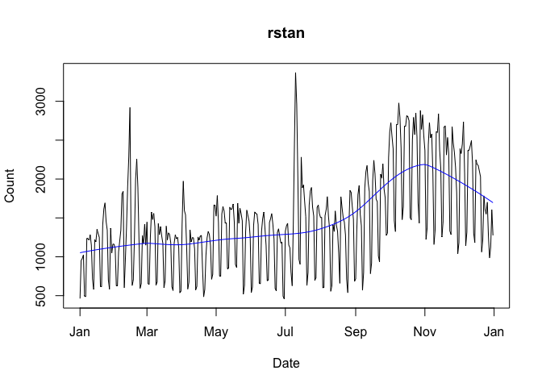
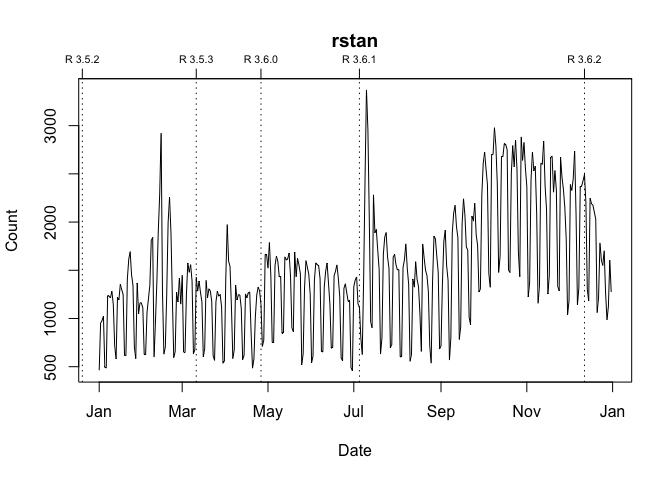
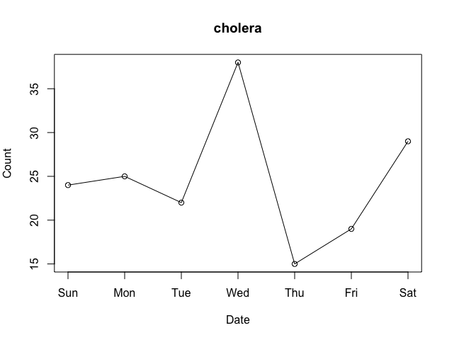

<!-- README.md is generated from README.Rmd. Please edit that file -->
[](https://cran.r-project.org/package=packageRank)
[](https://github.com/lindbrook/packageRank/blob/master/NEWS)
## packageRank: compute and visualize package download counts and rank percentiles

[‘packageRank’](https://CRAN.R-project.org/package=packageRank) is an R
package that helps put package download counts into context. It does so
via two functions, `cranDownloads()` and `packageRank()`.
`cranDownloads()` extends
[`cranlogs::cran_downloads()`](http://r-hub.github.io/cranlogs/) by
adding a `plot()` method and a more user-friendly interface.
`packageRank()` uses rank percentiles, a nonparametric statistic that
tells you the percentage of packages with fewer downloads, to help you
see how your package is doing compared to all other
[CRAN](https://CRAN.R-project.org/) packages.

NOTE: [‘packageRank’](https://CRAN.R-project.org/package=packageRank)
requires an active internet connection, and relies on the
[‘cranlogs’](https://CRAN.R-project.org/package=cranlogs) package
and on [RStudio’s logs](http://cran-logs.rstudio.com/). The latter
record traffic to what was previously called RStudio’s [CRAN
mirror](http://cran.rstudio.com) and which is now called the [“0-Cloud”
mirror](http://cloud.r-project.org) “sponsored by RStudio”. The logs for
the previous day are generally posted the following day at 18:00 (GMT+1)
or 17:00 UTC (GMT+2) (daylight saving time). Results for functions that
rely on ‘cranlogs’ are generally available soon thereafter.

### I - getting started

To install ‘packageRank’ from CRAN:

``` r
install.packages("packageRank")
```

To install the development version from GitHub:

``` r
# You may need to first install 'remotes' via install.packages("remotes").
remotes::install_github("lindbrook/packageRank", build_vignettes = TRUE)
```

### II - computing package download counts

`cranDownloads()` uses all the same arguments as
`cranlogs::cran_downloads()`:

``` r
cranlogs::cran_downloads(packages = "HistData")
```

    >         date count  package
    > 1 2020-05-01   338 HistData

``` r
cranDownloads(packages = "HistData")
```

    >         date count cumulative  package
    > 1 2020-05-01   338        338 HistData

The only difference is that `cranDownloads()` adds four features:

#### i) check package names

``` r
cranDownloads(packages = "GGplot2")
```

    ## Error in cranDownloads(packages = "GGplot2") :
    ##   GGplot2: misspelled or not on CRAN.

<br/>

``` r
cranDownloads(packages = "ggplot2")
```

    >         date count cumulative package
    > 1 2020-05-01 56357      56357 ggplot2

<br/> This also works for inactive or “retired” packages in the
[Archive](https://CRAN.R-project.org/src/contrib/Archive):

``` r
cranDownloads(packages = "vr")
```

    ## Error in cranDownloads(packages = "vr") :
    ##  vr: misspelled or not on CRAN/Archive.

<br/>

``` r
cranDownloads(packages = "VR")
```

    >         date count cumulative package
    > 1 2020-05-01    11         11      VR

<br/>

#### ii) two additional date formats

With `cranlogs::cran_downloads()`, you specify a time frame using the
`from` and `to` arguments. The downside of this is that you *must* use
the “yyyy-mm-dd” date format. For convenience’s sake and to reduce
typing, `cranDownloads()` also allows you to use “yyyy-mm” or “yyyy”
(yyyy also works).

##### “yyyy-mm”

Let’s say you want the download counts for
[‘HistData’](https://CRAN.R-project.org/package=HistData) for the
month of February 2020. With `cranlogs::cran_downloads()`, you’d have to
type out the whole date and remember that 2020 was a leap year:

``` r
cranlogs::cran_downloads(packages = "HistData", from = "2020-02-01",
  to = "2020-02-29")
```

<br/> With `cranDownloads()`, you can just specify the year and month:

``` r
cranDownloads(packages = "HistData", from = "2020-02", to = "2020-02")
```

##### “yyyy”

Let’s say you want the year-to-date download counts for
[‘rstan’](https://CRAN.R-project.org/package=rstan). With
`cranlogs::cran_downloads()`, you’d type something like:

``` r
cranlogs::cran_downloads(packages = "rstan", from = "2020-01-01",
  to = Sys.Date() - 1)
```

<br/> With `cranDownloads()`, you can just type:

``` r
cranDownloads(packages = "rstan", from = "2020")
```

<br/>

#### iii) check dates

`cranDownloads()` checks for valid dates:

``` r
cranDownloads(packages = "HistData", from = "2019-01-15",
  to = "2019-01-35")
```

    ## Error in resolveDate(to, type = "to") : Not a valid date.

#### iv) compute cumulative download counts

``` r
cranDownloads(packages = "HistData", when = "last-week")
```

    >         date count cumulative  package
    > 1 2020-05-01   338        338 HistData
    > 2 2020-05-02   259        597 HistData
    > 3 2020-05-03   321        918 HistData
    > 4 2020-05-04   344       1262 HistData
    > 5 2020-05-05   324       1586 HistData
    > 6 2020-05-06   356       1942 HistData
    > 7 2020-05-07   324       2266 HistData

<br/>

### III - visualizing package downloads

`cranDownloads()` makes visualizing package downloads easy. Just use
`plot()`:

``` r
plot(cranDownloads(packages = "HistData", from = "2019", to = "2019"))
```


If you pass a vector of package names for a single day, `plot()` will
return a dotchart:

``` r
plot(cranDownloads(packages = c("ggplot2", "data.table", "Rcpp"),
  from = "2020-03-01", to = "2020-03-01"))
```


If you pass a vector of package names for multiple days, `plot()`
defaults to using `ggplot2` facets:

``` r
plot(cranDownloads(packages = c("ggplot2", "data.table", "Rcpp"),
  from = "2020", to = "2020-03-20"))
```


<br/>

If you want to plot those data in a single frame, set `multi.plot =
TRUE`:

``` r
plot(cranDownloads(packages = c("ggplot2", "data.table", "Rcpp"),
  from = "2020", to = "2020-03-20"), multi.plot = TRUE)
```

<!-- -->

<br/> If you want separate plots, use `graphics = "base"` and you’ll be
prompted for each plot:

``` r
plot(cranDownloads(packages = c("ggplot2", "data.table", "Rcpp"),
  from = "2020", to = "2020-03-20"), graphics = "base")
```

If you want those plots independently, set `same.xy = FALSE`:

``` r
plot(cranDownloads(packages = c("ggplot2", "data.table", "Rcpp"),
  from = "2020", to = "2020-03-20"), graphics = "base", same.xy = FALSE)
```

#### `packages = NULL`

`cranlogs::cran_download(packages = NULL)` computes the total number of
package downloads from CRAN. You can plot these data by using:

``` r
plot(cranDownloads(from = 2019, to = 2019))
```

<!-- -->

#### `packages = "R"`

`cranlogs::cran_download(packages = "R")` computes the total number of
downloads of the R application (note that you can only use “R” or a
vector of packages names, not both\!). You can plot these data by using:

``` r
plot(cranDownloads(packages = "R", from = 2019, to = 2019))
```

<!-- -->

#### smoothers and confidence intervals

To add a lowess smoother to your plot, use `smooth = TRUE`:

``` r
plot(cranDownloads(packages = "rstan", from = "2019", to = "2019"),
  smooth = TRUE)
```

<!-- -->

With graphs that use ‘ggplot2’, `se = TRUE` will add confidence
intervals:

``` r
plot(cranDownloads(packages = c("HistData", "rnaturalearth", "Zelig"),
  from = "2020", to = "2020-03-20"), smooth = TRUE, se = TRUE)
```

<!-- -->

#### package and R release dates

To annotate a graph with a package’s release dates:

``` r
plot(cranDownloads(packages = "rstan", from = "2019", to = "2019"),
  package.version = TRUE)
```

<!-- -->

To annotate a graph with R release dates:

``` r
plot(cranDownloads(packages = "rstan", from = "2019", to = "2019"),
  r.version = TRUE)
```

<!-- -->

#### plot growth curves (cumulative download counts)

To plot growth curves, set `statistic = "cumulative"`:

``` r
plot(cranDownloads(packages = c("ggplot2", "data.table", "Rcpp"),
  from = "2020", to = "2020-03-20"), statistic = "cumulative",
  multi.plot = TRUE, points = FALSE)
```

<!-- -->

#### population plot

To visualize a package’s downloads relative to “all” other packages over
time:

``` r
plot(cranDownloads(packages = "HistData", from = "2020", to = "2020-03-20"),
  population.plot = TRUE)
```

<!-- -->

This longitudinal view of package downloads plots the date (x-axis)
against the logarithm of a package’s downloads (y-axis). In the
background, the same variable are plotted (in gray) using a stratified
random sample of packages: within each 5% interval of rank percentiles
(e.g., 0 to 5, 5 to 10, 95 to 100, etc.), a random sample of 5% of
packages is selected and tracked. This graphically approximates the
“typical” pattern of downloads on CRAN for the selected time period.

### IV - computing package download rank percentiles

Looking at nominal download count data leads one to the “compared to
what?” question. For instance, consider the data for the first week of
March 2020:

``` r
plot(cranDownloads(packages = "cholera", from = "2020-03-01",
  to = "2020-03-07"))
```



Do Wednesday and Saturday reflect surges of interest in the package or
surges of traffic to [CRAN](https://CRAN.R-project.org/)? To put it
differently, how can we know if a given download count is typical or
unusual?

One way to answer these questions is to locate your package in the
frequency distribution of download counts. Below are the distributions
for Wednesday and Saturday with the location of
[‘cholera’](https://CRAN.R-project.org/package=cholera) highlighted:


As you can see, the frequency distribution of package downloads
typically has a heavily skewed, exponential shape. On the Wednesday, the
most “popular” package had 177,745 downloads while the least “popular”
package(s) had just one. This is why the left side of the distribution,
where packages with fewer downloads are located, *looks* like a vertical
line.

To see what’s going on, I take the log of download counts (x-axis) and
redraw the graph. In these plots, the location of a vertical segment
along the x-axis represents a download count and its height represents a
download count’s frequency:

``` r
plot(packageDistribution(package = "cholera", date = "2020-03-04"))
```


``` r
plot(packageDistribution(package = "cholera", date = "2020-03-07"))
```


While these plots give us a better picture of where
[‘cholera’](https://CRAN.R-project.org/package=cholera) is located,
comparisons between Wednesday and Saturday are impressionistic at best:
all we can confidently say is that the download counts for both days
were greater than the mode.

To facilitate interpretation and comparison, I use the *rank percentile*
of a download count in place of the nominal download count. This
nonparametric statistic tells you the percentage of packages with fewer
downloads. In other words, it gives you the location of your package
relative to the locations of all other packages. More importantly, by
rescaling download counts to lie on the bounded interval between 0 and
100, rank percentiles make it easier to compare packages within and
across distributions.

For example, we can compare Wednesday (“2020-03-04”) to Saturday
(“2020-03-07”):

``` r
packageRank(package = "cholera", date = "2020-03-04", size.filter = FALSE)
>         date packages downloads            rank percentile
> 1 2020-03-04  cholera        38 5,556 of 18,038       67.9
```

On Wednesday, we can see that
[‘cholera’](https://CRAN.R-project.org/package=cholera) had 38
downloads, came in 5,556th place out of 18,038 unique packages
downloaded, and earned a spot in the 68th percentile.

``` r
packageRank(package = "cholera", date = "2020-03-07", size.filter = FALSE)
>         date packages downloads            rank percentile
> 1 2020-03-07  cholera        29 3,061 of 15,950         80
```

On Saturday, we can see that
[‘cholera’](https://CRAN.R-project.org/package=cholera) had 29
downloads, came in 3,061st place out of 15,950 unique packages
downloaded, earned a spot in the 80th percentile.

So contrary to what the nominal counts tell us, one could say that the
interest in [‘cholera’](https://CRAN.R-project.org/package=cholera) was
actually greater on Saturday than on Wednesday.

#### computing rank percentile

To compute rank percentiles, I do the following. For each package, I
tabulate the number of downloads and then compute the percentage of
packages with fewer downloads. Here are the details using
[‘cholera’](https://CRAN.R-project.org/package=cholera) from
Wednesday as an example:

``` r
pkg.rank <- packageRank(packages = "cholera", date = "2020-03-04",
  size.filter = FALSE)

downloads <- pkg.rank$crosstab

round(100 * mean(downloads < downloads["cholera"]), 1)
> [1] 67.9
```

To put it differently:

``` r
(pkgs.with.fewer.downloads <- sum(downloads < downloads["cholera"]))
> [1] 12250

(tot.pkgs <- length(downloads))
> [1] 18038

round(100 * pkgs.with.fewer.downloads / tot.pkgs, 1)
> [1] 67.9
```

#### nominal ranks

In the example above, 38 downloads puts ‘cholera’ in 5,556th place among
the 18,038 packages downloaded. This rank is “nominal” because it’s
possible that multiple packages can have the same number of downloads.
As a result, a package’s nominal rank (but not its rank percentile) can
be affected by its name: packages with the same number of downloads are
sorted in alphabetical order. Thus, ‘cholera’ benefits from the fact
that it is 31st in the list of 263 packages with 38 downloads:

``` r
pkg.rank <- packageRank(packages = "cholera", date = "2020-03-04",
  size.filter = FALSE)
downloads <- pkg.rank$crosstab

which(names(downloads[downloads == 38]) == "cholera")
> [1] 31
length(downloads[downloads == 38])
> [1] 263
```

### V - visualizing package download rank percentiles

To visualize `packageRank()`, use `plot()`.

``` r
plot(packageRank(packages = "cholera", date = "2020-03-04"))
```


<br/>

``` r
plot(packageRank(packages = "cholera", date = "2020-03-07"))
```


These graphs, customized to be on the same scale, plot the *rank order*
of packages’ download counts (x-axis) against the logarithm of those
counts (y-axis). It then highlights a package’s position in the
distribution along with its rank percentile and download count (in red).
In the background, the 75th, 50th and 25th percentiles are plotted as
dotted vertical lines. The package with the most downloads,
[‘magrittr’](https://CRAN.R-project.org/package=magrittr) in both
cases, is at top left (in blue). The total number of downloads is at the
top right (in blue).

### VI - filter “small” downloads

`packageDistribution()`, `packageRank()` and `packageLog()` have a
‘size.filter’ argument that removes downloads smaller than 1000 bytes.
This can provide a more accurate count of package downloads. For
example, here is a raw download count:

``` r
packageRank(packages = "HistData", date = "2019-10-30", size.filter = FALSE)
>         date packages downloads          rank percentile
> 1 2019-10-30 HistData       403 794 of 17,396       95.4
```

Below is a filtered count.

``` r
packageRank(packages = "HistData", date = "2019-10-30", size.filter = TRUE)
>         date packages downloads          rank percentile
> 1 2019-10-30 HistData       382 796 of 15,330       94.8
```

Besides a difference of 21 downloads, notice that the number of unique
packages downloaded falls from 17,396 to 15,330.

By default, `size.filter = TRUE` for `packageRank()` while `size.filter
= FALSE` for `packageDistribution()` and `packageLog()`. For details
about “small” downloads see the “Inflationary Bias of Download Counts”
section of this
[post](https://blog.r-hub.io/2020/05/11/packagerank-intro/#inflationary-bias-of-download-counts)
on the [R-hub blog](https://blog.r-hub.io).

### VII - memoization

To avoid the bottleneck of downloading multiple log files,
`packageRank()` is currently limited to individual days. However, to
reduce the need to re-download logs, ‘packageRank’ makes use of
memoization via the ‘memoise’ package.

Here’s relevant code:

``` r
fetchLog <- function(url) data.table::fread(url)

mfetchLog <- memoise::memoise(fetchLog)

if (RCurl::url.exists(url)) {
  cran_log <- mfetchLog(url)
}

# Note that data.table::fread() relies on R.utils::decompressFile().
```

If you use `fetchLog()`, the log file, which can be upwards of 50 MB,
will be downloaded each time you call the function. But if you use
`mfetchLog()`, the logs are intelligently cached; those that have
already been downloaded, in your current R session, will not be
downloaded again.
