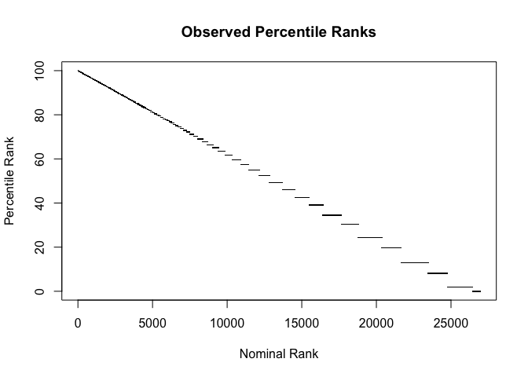

Note on queryPercentile()
================
lindbrook
2026-03-11

Due to the discrete nature of counts, your choice of percentile may not
be available. This is because they may fall in the vertical gaps in the
observed data:

<!-- -->

For this reason, `queryPercentile()` rounds your selection to whole
numbers. Also, be aware that the default value, which is set to 50, uses
`median()`to guarantee a result.

``` r
head(queryPercentile())
```

    >    package count  rank nominal.rank percentile
    > 1 AATtools    12 13697        12845       49.2
    > 2    abdiv    12 13697        12846       49.2
    > 3 abglasso    12 13697        12847       49.2
    > 4  ablasso    12 13697        12848       49.2
    > 5   Ac3net    12 13697        12849       49.2
    > 6      acp    12 13697        12850       49.2

You can also set a range of percentile ranks using the ‘lo’ and/or ‘hi’
arguments. If you get an error message, you may need to widen your
interval:

``` r
head(queryPercentile(lo = 95, hi = 96), 3)
tail(queryPercentile(lo = 95, hi = 96), 3)
```

    >      package count rank nominal.rank percentile
    > 1    mapdata   420  931          931       96.5
    > 2 shinyalert   418  932          932       96.5
    > 3       klaR   416  935          933       96.5
    >                package count rank nominal.rank percentile
    > 536 PortfolioAnalytics   189 1466         1466       94.6
    > 537              binom   188 1468         1467       94.6
    > 538            prefmod   188 1468         1468       94.6
