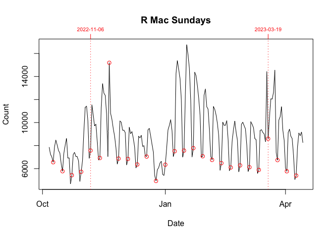
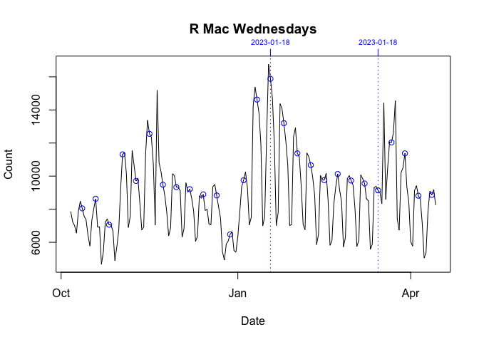
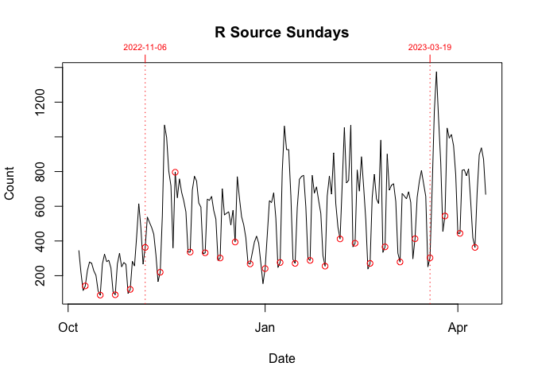
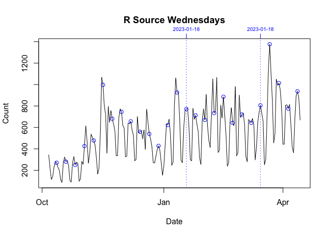
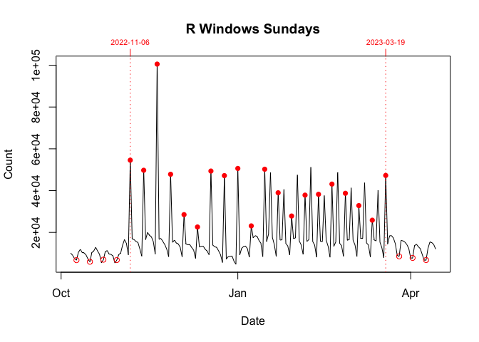
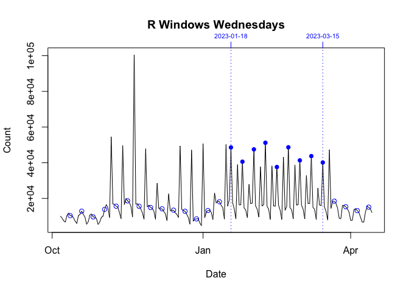

R Windows Spikes 2002-2023
================
lindbrook
2026-03-10

<!-- https://github.com/lindbrook/packageRank#r-windows-sunday-and-wednesday-download-spikes-(06-nov-2022---19 march =-2023) -->

On Sundays and Wednesdays from 2022-11-06 through 2023-03-19, there were
spikes in the download of the Windows R application.

The graphs below decompose the data in the plot in README. Each plot,
which is identically scaled, breaks down the data by day (Sunday or
Wednesday) and platform. The key thing is to compare the data in the
period bounded by vertical dotted lines with the data before and after.
If a Sunday or Wednesday is orders-of-magnitude unusual, I plot that day
with a filled rather than an empty circle. Only Windows, the final two
graphs below, earn this distinction.

<!-- --><!-- -->

<!-- --><!-- -->

<!-- --><!-- -->
